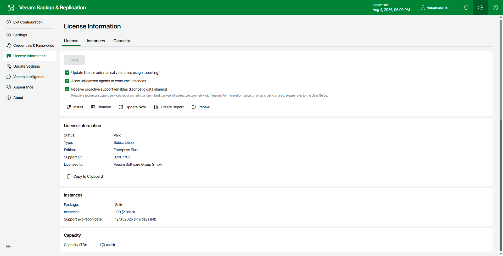
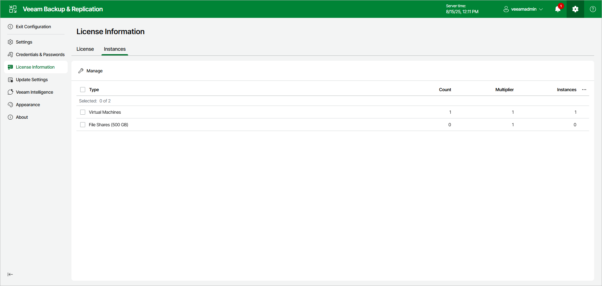
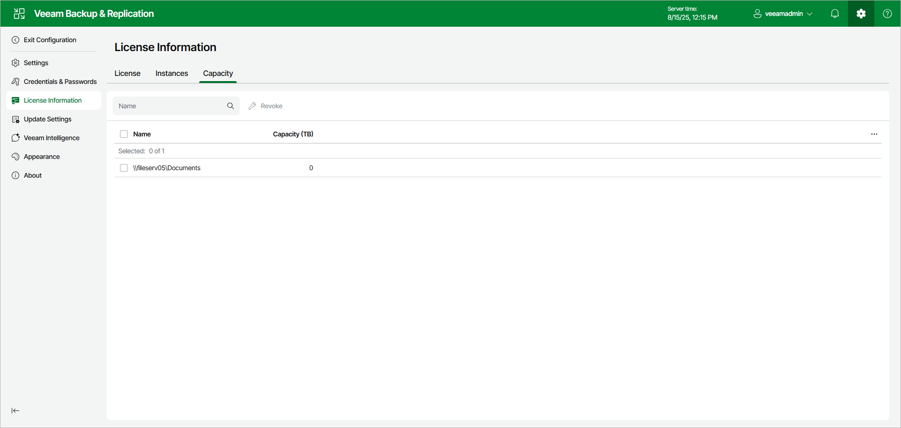

# Viewing License Information Using Web UI

You can view details of the installed license in the License Information window of the Veeam Backup & Replication web UI.

To open the License Information window, click the gear icon in the top bar and select License Information.

You can select the following options for your license management:

* To enable automatic license update, select the Update license automatically check box. For more information, see [Updating License Automatically](license_autoupdate.md).
* By default, Veeam Backup & Replication allows Veeam Agents to connect to the Veeam backup server and consume instances in the license. If you do not want Veeam Agents to consume instances, clear the Allow unlicensed agents to consume instances check box. For more information on Veeam Agents licensing, see the following user guides:

* If you work with Veeam Agents operating in the managed mode, see the [Licensing Requirements](agents_licensing_requirements.md) section in Veeam Agent Backup.
* If you work with Veeam Agents operating in the standalone mode, see the user guide for the Veeam Agent depending on the operating system of the protected computer. For example, if you work with Veeam Agent for Microsoft Windows, see the [Managing License](https://helpcenter.veeam.com/docs/agentforwindows/userguide/license_vbr.html?ver=13) section in the Veeam Agent for Microsoft Windows User Guide.

* To receive proactive technical support services, select the Receive proactive support check box.

Selecting this option also enables diagnostic data sharing. The log is shared once a week. You can review the contents of the telemetry log at the following location on your backup server: C:\ProgramData\Veeam\Backup\Utils\VMC.log.

To learn how sensitive data is processed, see [Processing of Sensitive Data in Veeam Technical Support](https://www.veeam.com/processing_of_sensitive_data_in_support_ds.pdf).

The following details are available for the current license:

* Status — license status (Valid, Invalid, Expired, Not Installed, Warning, Error).
* Type — license type (Perpetual, Subscription, Rental, Evaluation, NFR, Free).
* Edition — license edition (Community, Standard, Enterprise, Enterprise Plus).
* Support ID — support ID required for contacting Veeam Support.
* Licensed to — name of a person or organization to which the license was issued.
* Cloud Connect Provider — shows if you can use Veeam Backup & Replication to offer cloud repository as a service and disaster recovery as a service to your customers (Enterprise, Yes, No) (not available for Veeam Software Appliance 13.0.0 (build 13.0.0.4967)). For more information on Veeam Cloud Connect, see [Veeam Cloud Connect Guide](https://helpcenter.veeam.com/docs/vbr/cloud/cloud_overview.html?ver=13).
* Package — Veeam license pack: Essentials, Backup, Suite, ONE.
* Sockets — number of sockets that you can use to protect workloads (not available for Veeam Software Appliance 13.0.0 (build 13.0.0.4967)).
* Instances — number of instances that you can use to protect workloads.
* Points — number of points that you can use to protect workloads. For more information, see the [Veeam Rental Licensing and Usage Reporting Reference Guide](https://helpcenter.veeam.com/docs/vcsp/refguide/about.html).
* Expiration date — date when the license expires.
* Support expiration date — date when expires the support and maintenance specified by [Veeam Licensing Policy](https://www.veeam.com/licensing-policy.html). Valid for Perpetual Socket and Perpetual Instance licenses.
* Promo instances — number of additional instances granted by the Promo license.
* Promo expiration date — date when the Promo license expires.
* Total instances including promo — number of all available instances, regular and promo added up.
* Capacity — protected front end capacity (in TB) for unstructured data backup.

Viewing Information on Instances

With instance licenses, Veeam Backup & Replication applies a license to a protected workload. The number of license instances that a protected workload consumes depends on the workload type and product edition. For details, see [Veeam Licensing Policy](https://www.veeam.com/licensing-policy.html#instance-conversion).

To view to which objects the license is currently applied, open the Instances tab.

For peculiarities of instance licensing, see the [Licensing](licensing.md#instance) section.

Viewing Information on Capacity

With a capacity license, Veeam Backup & Replication applies the license to protected unstructured data sources. For details, see [Veeam Licensing Policy](https://www.veeam.com/licensing-policy.html#instance-conversion).

To view which data sources currently consume the license capacity, open the Capacity tab.

For peculiarities of capacity licensing, see the [Licensing](licensing.md#capacity) section.

Viewing Information on Points

With a rental license, Veeam Backup & Replication applies the license to protected tenant workloads. For details,

To view which data sources currently consume the license points, open the Points tab.

For peculiarities of points licensing, see the [Veeam Rental Licensing and Usage Reporting Reference Guide](https://helpcenter.veeam.com/docs/vcsp/refguide/about.html).

Creating Current License Consumption Report

If you have an instance license and at least one instance is already consumed by Veeam Backup & Replication, you can create a Current License Consumption report. To run the report, click Create Report in the License Information window.

The report contains the following information about instance license consumption:

* License information

This section contains the general information about the instance license:

* License edition (Community, Standard, Enterprise, Enterprise Plus)
* Package
* License expiration date
* Name of a person or organization to which the license was issued
* Support ID
* Installation ID

* Summary of license consumption

The section contains a short overview of instance consumption by different workload types (virtual machines, physical machines, unstructured data backup, and so on).

* License consumption by workloads

This section contains detailed information about consumed instances, which are grouped by workload types. Each sub-section lists the following information about the workloads:

* Workload name
* Number of the consumed instances
* Workload sub-type (vSphere, Hyper-V, Proxmox VE VM, and so on)
* Name of the job that consumed the instances
* Date of the last job run
* Notes

