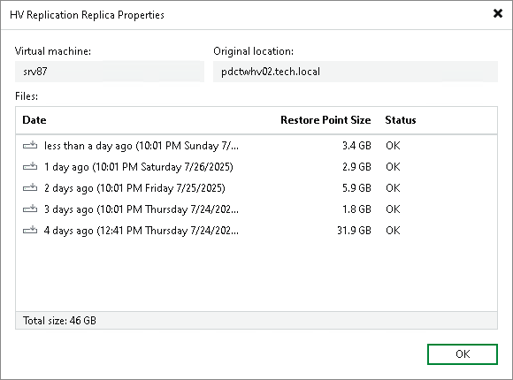

# Viewing Replica Properties

You can view summary information about created replicas. The summary information provides the following data:

* Available restore points
* Date of restore points creation
* Data size and replica status

To view replica properties:

1. Open the Home view.
2. In the [inventory pane](vbr_ui.md), select Replicas.
3. In the working area, right-click the necessary replica and select Properties. Alternatively, select Properties on the ribbon.

