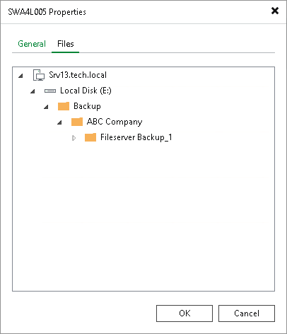

# Viewing Data on Tapes

To view data contents that is currently stored on tape:

1. Open the Tape Infrastructure view.
2. Navigate to the list of tapes either under Media Pools or under Libraries > LibraryName node > Media > Online.
3. Select the necessary tape and click Properties on the ribbon. Alternatively, you can right-click the tape and select Properties.
4. Open the Files tab.

You will see a list of protected hosts, repository servers and file shares where the contents of the tape originate from. Under each name, you will see folders and files that the selected tape stores.

