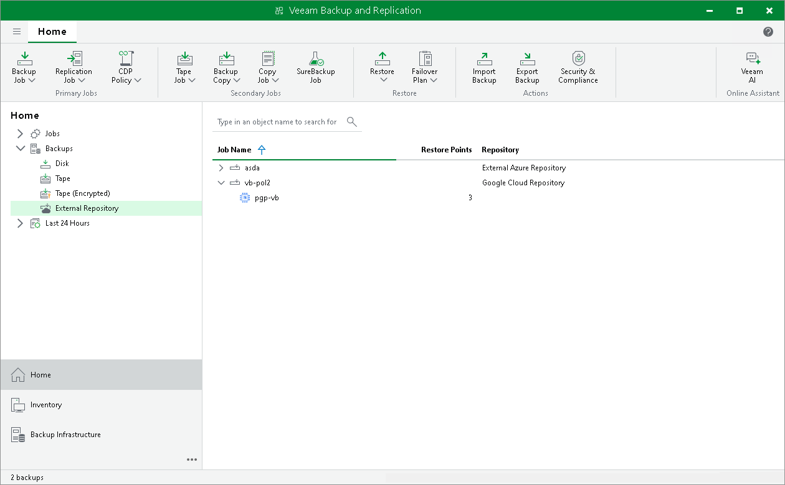

# Viewing External Repository Data

After you add an external repository to the backup infrastructure, you can view backups in External Repository and External Repository (Encrypted) nodes of the Backups node in the Home view.

* In the External Repository node, Veeam Backup & Replication displays:

* Amazon EC2 instance backups that were decrypted at the [Bucket](external_repository_details.md) step of the New External Repository wizard.
* Microsoft Azure VMs that were decrypted at the [Container](external_azure_container.md) step of the New External Repository wizard.
* Google Cloud VM instances that were decrypted at the [Bucket](external_google_cloud_details.md) step of the New External Repository wizard.

* In the External Repository (Encrypted) node, Veeam Backup & Replication displays:

* EC2 instance backups that were encrypted by Veeam Backup for AWS.
* Microsoft Azure VMs that were encrypted by Veeam Backup for Microsoft Azure.
* Google Cloud VM instances that were encrypted by Veeam Backup for Google Cloud.

To decrypt backups, select a backup policy that created the backups you want to decrypt, click Specify Password on the ribbon, provide a password and click OK.

Related Topics

[Adding External Repositories](external_repositories_add.md)

