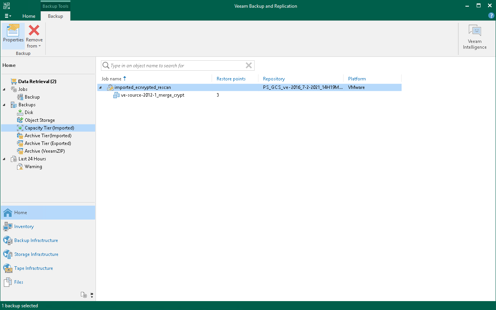

# Viewing Imported Backups

In this article

To view [imported](osr_import_backups.md) backups, do the following:

1. Open the Home view.
2. In the navigation pane, select the Backups > Capacity Tier (Imported) or Archive Tier (Imported) node.
3. In the preview pane, review imported backups.

Page updated 5/27/2024

Page content applies to build 13.0.1.1071
