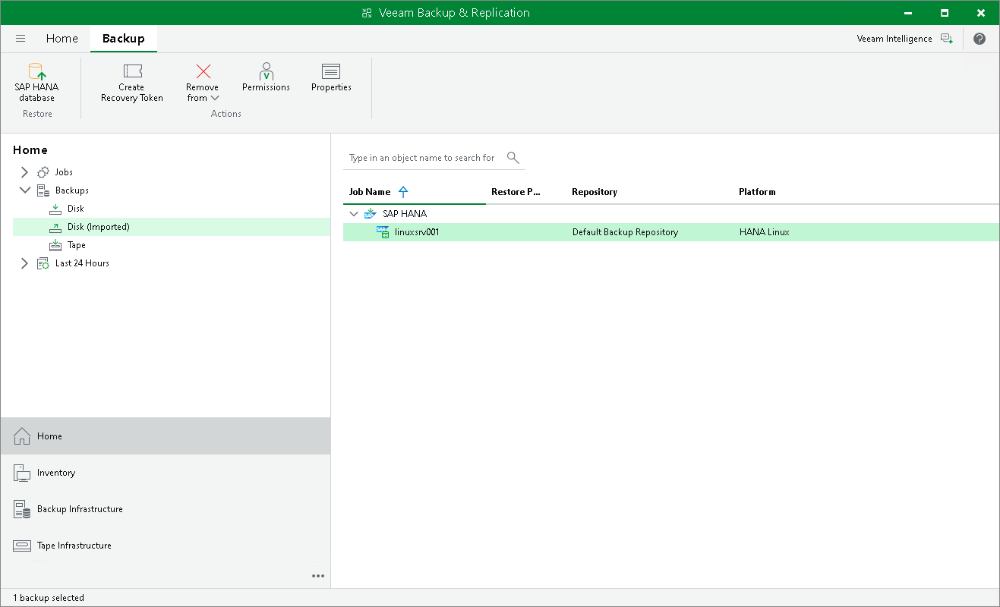

# Viewing Restored Backups

After backups are restored from tape, they are displayed as imported backups in the Home view > Backups > Disk (Imported). You can use the restored to disk backup for regular data recovery, including full recovery, recovery of VM files, guest OS file restore, database recovery, and others.

Page updated 2026-07-16

