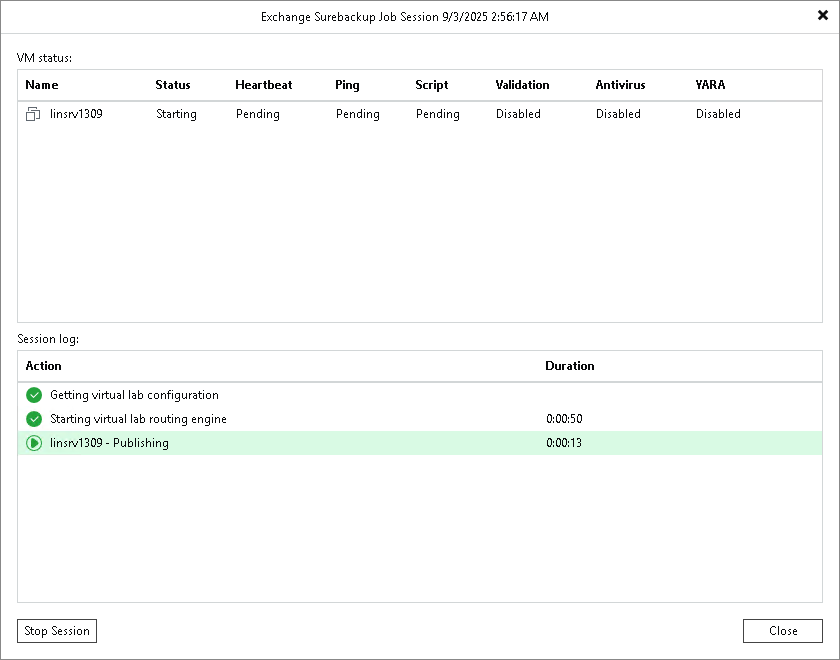

# Viewing Recovery Verification Job Statistics

You can monitor how tests for verified VMs are performed while a recovery verification job is running.

To see the status of VM tests:

1. Open the Home view.
2. In the inventory pane, select SureBackup under Jobs.
3. In the working area, right-click a recovery verification job and select Statistics. You can also double-click the job in the list.

The job session window displays statistics for all VMs that are started during the SureBackup job: VMs from the application group in the specified order and VMs from linked jobs. For your convenience, these VMs are marked with different icons.

After the verified VM is powered on, its name is displayed as a hyperlink. You can click the link to open the VM console to see what is happening inside the VM or perform manual testing.

If some VM fails to be verified automatically, you can start it manually when this VM is powered off. To start a VM, right-click the VM in the list and select Start. If the application group has already been powered off by that time, it will be started again. After that, you can open the VMware Remote Console (VMRC) and perform verification and testing manually.

|  |
| --- |
| Important |
| VMware Remote Console is not included as part of Veeam Backup & Replication installation and must be installed separately. For details, see [Install the VMware Remote Console Application](https://docs.vmware.com/en/VMware-vSphere/7.0/com.vmware.vsphere.vm_admin.doc/GUID-38040DA5-2700-4D3F-8D7C-9996CCD6B2C7.html). |

If you enabled content analysis at the [Settings step](surebackup_job_settings_vm.md) of the SureBackup job wizard, you can view the detailed logging of the scan process. To view logs, click the Scan Log button that will appear at the bottom of the job session window after the scan is complete.

