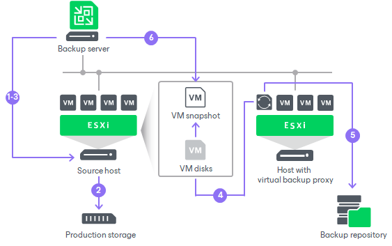

# Data Backup and Restore in Virtual Appliance Mode

In this article

The process of data retrieval in the Virtual appliance transport mode includes the following steps:

1. The backup server sends a request to the ESXi host to locate the necessary VM on the datastore.
2. The ESXi host locates the VM.
3. Veeam Backup & Replication triggers VMware vSphere to create a VM snapshot.
4. VM disks are attached (hot-added) to the VMware backup proxy.
5. Veeam Backup & Replication reads data directly from disks attached to the VMware backup proxy.
6. When the VM processing is complete, VM disks are detached from the VMware backup proxy and the VM snapshot is deleted.

The process of data restore in the Virtual appliance mode works in a similar manner. VM disks from the backup are attached to the VMware backup proxy and Veeam Backup & Replication transports VM data to the target datastore. After the restore process is finished, VM disks are detached from the VMware backup proxy.

ESXi host interacts with VMware Cloud on AWS through VMware vCenter. Veeam Backup & Replication performs backup through the networkless Virtual appliance (HotAdd) mode.

Page updated 6/8/2023

Page content applies to build 13.0.1.1071
