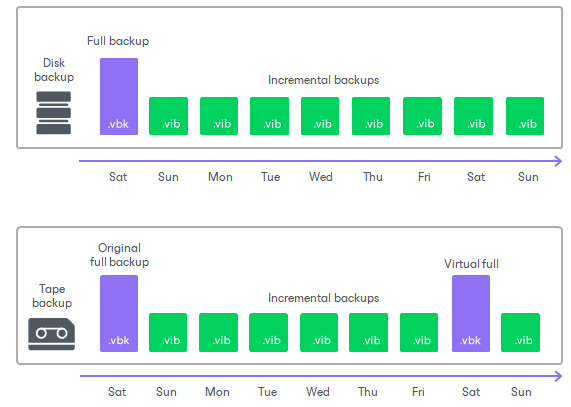

# Virtual Full Backup

The virtual full backup allows you to transform backup chains created by source backup and backup copy jobs to save them to tapes. Unlike disk backups, tape archives are static: tape jobs cannot rebuild backups once they are written to tape. Also, if the source job has forever forward incremental backup chain configured, then the tape archive will have one full backup and an endless chain of increments all of which would be required for restore. To adapt such backup chains to tapes, Veeam Backup & Replication uses the virtual full backup.

The virtual full backup mechanism creates a periodic synthesized full backup on tape. The periodic full backups split the backup chain into shorter series of files that can be effectively stored to tapes. Each series contains one synthesized full backup and a set of increments. Such series are convenient for restore: you will need to load to the tape device only those tapes that are part of one series.

The virtual full backup does not require additional repository disk space: it is synthesized directly on tape on the fly when the tape job runs. To build such full backup, Veeam Backup & Replication uses backup files that are already stored in the backup repository.

The virtual full backup is enabled automatically if the source job has no scheduled full backups, for example, a job with forever forward incremental backup chain. For the other types of source jobs you can enable the virtual full backup manually at the [Media Pool](backup_to_tape_pools.md) step of the New Backup to Tape Job wizard.

You can schedule the virtual full backup on a specific day (or days) of week. The virtual full backup does not necessarily need to be scheduled on the day when the tape job runs. When the tape job starts, it synthesizes the source machines state as they were on the chosen day. For example, you can set Friday as the virtual full backup day, and schedule the tape job to run on Saturday. The tape job will not run on Friday. On Saturday, the tape job will copy blocks of data to reconstruct the state of the machines as they were on Friday (or, if no backup is available for Friday, the closest day preceding Friday).

You can customize the virtual full backup schedule according to your needs, although you cannot disable the virtual full backup if you back up the forever forward incremental backup chain. Also, you cannot create more than one virtual full backup a day.

|  |
| --- |
| Note |
| Consider the following:   * [For regular backup to tape jobs] If multiple scheduled virtual full backups were missed, the backup to tape job will write only the latest missed virtual full backup on the next run. * [For GFS backup to tape jobs] The source job configuration and the backup chain type do not have an impact on the virtual full backups. For more information, see [How GFS Backup to Tape Works](gfs_to_tape_hiw.md). |

Related Topics

* [How Virtual Full Backup Works](virtual_full_backup_hiw.md)
* [Virtual Full Intervals](virtual_full_intervals.md)

