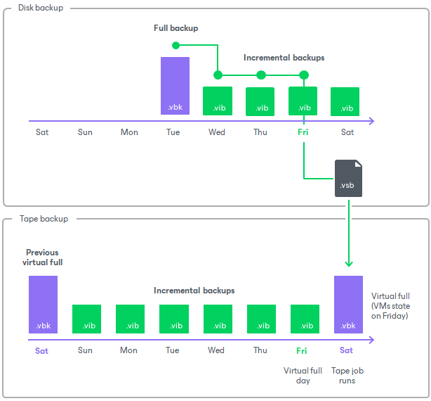

# How Virtual Full Backup Works

When the tape job archives the source backup chain, it copies the full backup from disk only once. After that, it copies new increments and creates virtual fulls regularly, or, if archiving of increments is disabled, creates only virtual fulls.

To create a virtual full backup, Veeam Backup & Replication uses a small temporary file of the VSB (Veeam Synthetic Backup) format. The VSB file does not contain backup data; it contains pointers to data blocks inside files of the backup chain on disk that are required to build a full backup as for the needed day. Using these pointers, the tape job detects these blocks and writes them to tape.

To create a virtual full backup, the tape job performs the following operations:

1. On the day the tape job runs, it creates a VSB file and stores it in the backup repository, next to restore points in the backup chain.
2. According to the VSB file pointers, the tape job detects what backup chain and what data blocks on disk are required to synthesize a full backup, and writes these blocks to tape as a full backup file (VBK).
3. At the end of the tape job session, the VSB file is removed from the backup repository.

For example:

* The source backup job creates an increment every day.
* The tape job is scheduled on Saturday with a virtual full on Friday.

On Saturday, the tape job picks data blocks from the full backup on Tuesday and the subsequent increments up to Friday. Using these blocks, the tape job synthesizes a virtual full that represents the machine state as of Friday.

|  |
| --- |
| Note |
| If the source backup chain contains a full backup that was created on the virtual full day (for example, an active full backup created manually), the tape job will copy it and will not create a virtual full. |

