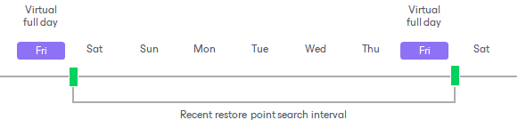
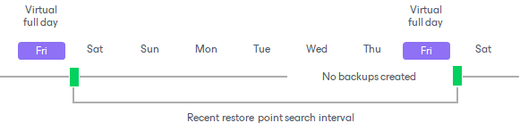
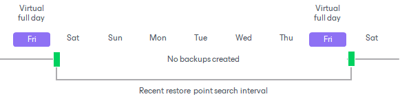

# Virtual Full Intervals

In this article

When the tape job needs to create a new virtual full, it analyzes the tape archive and detects the date of the last virtual full on tape. To create a new virtual full, the tape job needs restore points that were created in the following interval:

* The start of the interval is midnight after the last virtual full was created (the end of tape writing session).
* The end of the interval is midnight after the virtual full day.

To synthesize a new virtual full, the tape job needs at least one increment created in this interval. If there are many increments, the tape job builds a virtual full up to the most recent increment within the interval.

Missing Source Backups

The source chain may not contain an increment on the virtual full day. In this case, the tape job uses a backup that is closest to the virtual full day within the virtual full interval. For example, if the source backup closest to the virtual full day was on Tuesday, the tape job will synthesize a virtual full that represents the machine state as of Tuesday.

The source chain may have missing backups because of the following reasons:

* The source job does not run on the virtual full day.
* The tape job has multiple source jobs scheduled on different days. Some of the source jobs do not create a backup on the virtual full day.
* The source job fails to produce increments for several days, for example, because of a hardware breakdown, network inaccessibility or if the source job was disabled by the user for some time.
* Some machines in the source job have corrupted backups. The tape job will use the last valid backups for these machines and create the virtual full up to the latest valid restore point.

No Backups in the Virtual Full Interval

The source job may not produce any backups after the previous full backup day. In this case, the tape job will not create a virtual full for this period.

|  |
| --- |
| Important |
| The virtual full cannot be forced before its scheduled day. For example, if you start the tape job manually but the virtual full backup day is in future, the virtual full backup will not be created. |

Page updated 8/6/2025

Page content applies to build 13.0.1.1071
