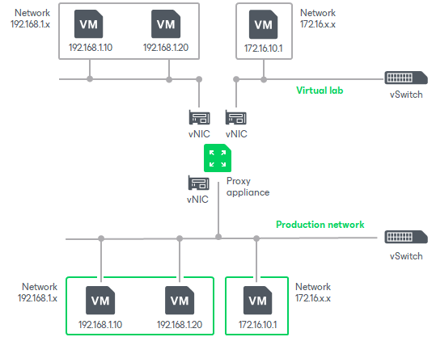

# Virtual Lab

In this article

The virtual lab is an isolated virtual environment in which Veeam Backup & Replication verifies VMs. In the virtual lab, Veeam Backup & Replication starts VMs from the application group and the verified VM. The virtual lab is used not only for the SureBackup verification procedure, but also for [U-AIR](https://www.veeam.com/veeam_backup_12_uair_wizard_user_guide_pg.pdf), On-Demand Sandbox and staged restore.

The virtual lab itself does not require that you provision extra resources for it. However, VMs running in the virtual lab consume CPU and memory resources of the ESXi host where the virtual lab is deployed. All VM changes that take place during recovery verification are written to redo log files. By default, Veeam Backup & Replication stores redo logs on the datastore selected in the virtual lab settings and removes redo logs after the recovery process is complete.

The virtual lab is fully fenced off from the production environment. The network configuration of the virtual lab mirrors the network configuration of the production environment. For example, if verified VMs and VMs from the application group are located in two logical networks in the production environment, the virtual lab will also have two networks. The networks in the virtual lab will be mapped to necessary production networks.

VMs in isolated networks have the same IP addresses as in the production network. This lets VMs in the virtual lab function just as if they function in the production environment.

In This Section

* [Proxy Appliance](surebackup_proxy_appliance.md)
* [IP Masquerading](surebackup_ip_masquerading.md)
* [Static IP Mapping](surebackup_ip_mapping.md)
* [Virtual Lab Configuration](surebackup_vlab_config.md)
* [Creating Virtual Lab](create_vlab.md)
* [Connecting to Existing Virtual Lab](connect_to_vlab.md)
* [Editing and Deleting Virtual Labs](vlab_edit_delete.md)

Page updated 4/29/2025

Page content applies to build 13.0.1.1071
