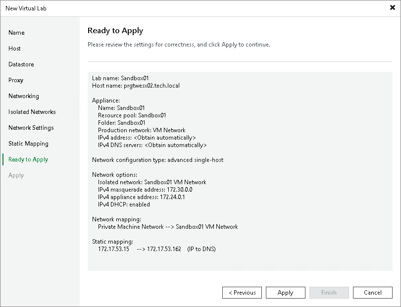

# Step 10. Apply Parameters

At the Ready to Apply step of the wizard, complete the procedure of virtual lab configuration.

1. Review details of the virtual lab.
2. Click Apply to create the virtual lab.
3. At the last step of the wizard, click Finish to exit the wizard.

