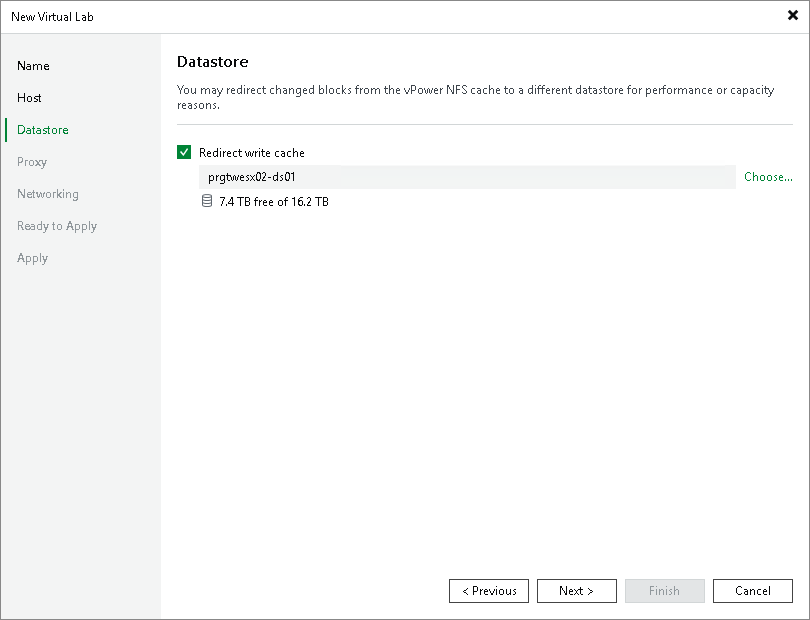

# Step 4. Select Datastore

At the Datastore step of the wizard, you can select where redo logs for verified VMs must be stored. Redo logs are auxiliary files used to keep changes that take place when VMs run in the virtual lab. By default, redo logs are stored on the [vPower NFS server](vpower_nfs_service.md). However, you can store redo logs on any datastore in the virtual environment. Redirecting redo logs improves verification performance. As soon as a recovery verification job completes, Veeam Backup & Replication deletes redo logs.

To redirect redo logs:

1. Select the Redirect write cache check box.

If you perform staged restore, the Redirect write cache option allows you to select a datastore where VM delta files will be stored. Delta files are auxiliary files that keep changes made to a VM during script execution. For more information, see [Staged Restore](staged_restore_about.md).

1. Click Choose and select a datastore from the list.

|  |
| --- |
| Important |
| If disks of verified VMs are greater than 2 TB, you must not place redo logs on a VSAN datastore. Otherwise, Veeam Backup & Replication will fail to create snapshots for verified VMs. For more information, see [VMware Docs](https://docs.vmware.com/en/VMware-vSphere/6.5/com.vmware.vsphere.storage.doc/GUID-88E5A594-DEBC-4662-812F-EA421591C70F.html). |

