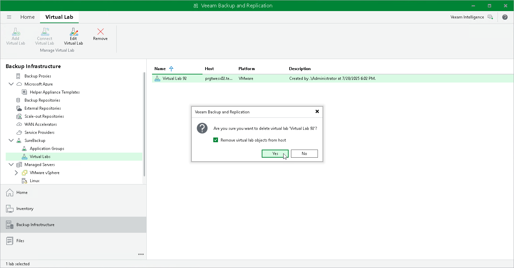

# Editing and Deleting Virtual Labs

In this article

You can edit settings of a virtual lab or delete the virtual lab.

Always use Veeam Backup & Replication to modify or delete a virtual lab. If you edit virtual lab settings or delete any of its components from outside, for example, in vSphere Client, the lab will be corrupted and its component such as the created vSwitch, resource pool will remain in the virtual infrastructure.

Editing Virtual Labs

To edit settings of a virtual lab:

1. Open the Backup Infrastructure view.
2. In the inventory pane, select Virtual Labs under SureBackup.
3. In the working area, select a virtual lab and click Edit Virtual Lab on the ribbon or right-click the virtual lab and select Properties.
4. Edit virtual lab settings as required.

Removing Virtual Labs

To remove a virtual lab:

1. Open the Backup Infrastructure view.
2. In the inventory pane, select Virtual Labs under SureBackup.
3. In the working area, select a virtual lab and click Remove Virtual Lab on the ribbon or right-click the virtual lab and select Remove.
4. If you want to remove virtual lab object from the virtual infrastructure, in the displayed window select the Remove virtual lab objects from host check box. If you do not enable this option, Veeam Backup & Replication will disconnect the virtual lab from the backup server. You will be able to connect to this virtual lab later.

Page updated 9/2/2025

Page content applies to build 13.0.1.1071
