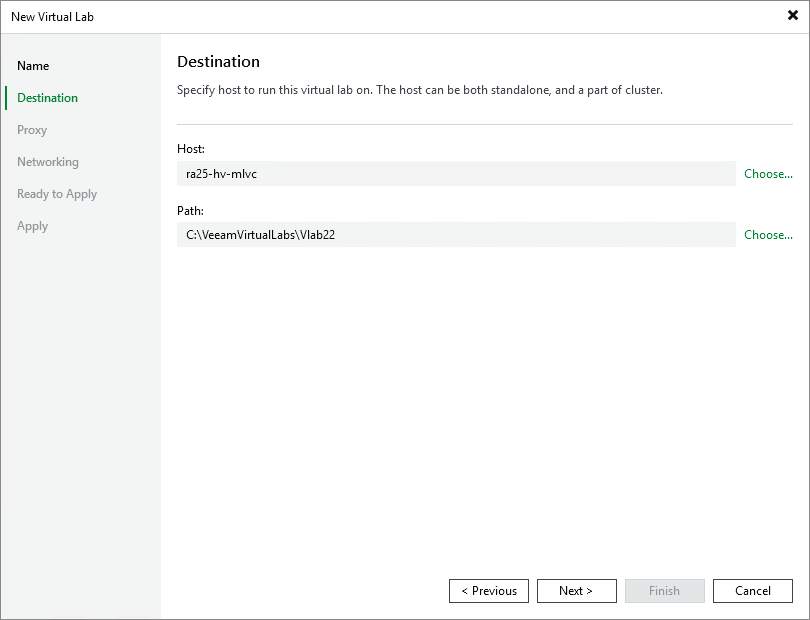

# Step 3. Select Host

At the Destination step of the wizard, select a Microsoft Hyper-V host on which the virtual lab must be created.

1. Click Choose next to the Host field to select a Microsoft Hyper-V host. You can select a standalone Hyper-V host or host being a part of the Hyper-V cluster.
2. For every new virtual lab, Veeam Backup & Replication creates a dedicated folder on the host, by default, C:\VeeamVirtualLabs\. To specify another folder, click Choose next to the Path field and select the necessary folder.

To the virtual lab folder, Veeam Backup & Replication copies files of the proxy appliance. The folder is also used as a mount point for VMs started in the virtual lab. In this folder, Veeam Backup & Replication “publishes” virtual disk and configuration files of verified VMs and VMs from the application group. These files are visible to the user as having the size of original VM files.

Veeam Backup & Replication emulates the presence of VM files in the virtual lab folder. The virtual disks themselves are still located in the backup file in the backup repository. All VM changes that take place during recovery verification are written to the differencing disk (AVHD/AVHDX file) which Veeam Backup & Replication creates for the recovered VM. When the recovery verification process is complete, the changes are discarded. For more information, see [How SureBackup Works](surebackup_hiw_hv.md).

