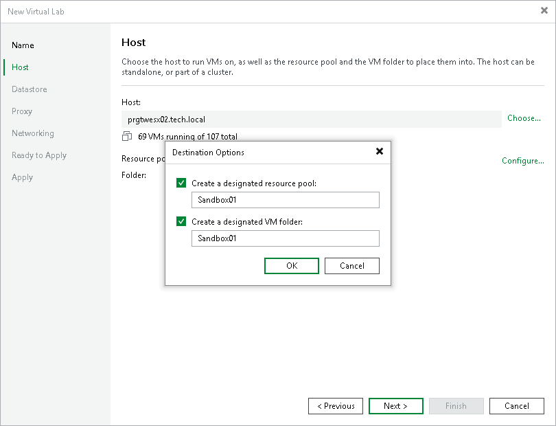

# Step 3. Select Host

In this article

At the Host step of the wizard, select an ESXi host on which the virtual lab must be created.

To select an ESXi host:

1. Click Choose.
2. Select an ESXi host on which the new virtual lab must be created. You can select a standalone ESXi host or an ESXi host being part of a cluster or vCenter Server hierarchy.
3. For every new virtual lab, Veeam Backup & Replication creates a dedicated folder and resource pool on the ESXi host. By default, the folder and pool have the same name as the virtual lab. To change the name of the folder and resource pool, click Configure. In the Destination Options window, enter the necessary names.

|  |
| --- |
| Important |
| You cannot create resource pools in clusters with disabled DRS. If the target host is a part of such a cluster, the Create a designated resource pool option will be disabled in the Destination Options window. |

Selecting an ESXi Host for VM Replicas Verification

When you select an ESXi host for the virtual lab where VM replicas will be verified, mind the location of verified VM replicas and VM replicas added to the application group:

* If verified VM replicas and VM replicas from the application group are located on the same ESXi host, you must select the ESXi host on which these VM replicas are registered. Verified VM replicas and VMs from the application group will be started on the selected ESXi host. If the application group contains VMs added from VM backups or storage snapshots, these VMs will also be started on the selected ESXi host.

For this type of virtual lab configuration, you need to choose one of single-host networking modes: Basic single-host or Advanced single-host. For more information, see [Selecting a Networking Mode](vlab_network_vm.md).

* If verified VM replicas and VM replicas from the application group are located on different ESXi hosts, you can select any ESXi host in your virtual environment. Veeam Backup & Replication will create the virtual lab on the selected ESXi host. Verified VM replicas and VM replicas from the application group will be started on ESXi hosts where they are registered and connected to the virtual lab with the help of VMware DVS technology.

The ESXi host on which the virtual lab is created must meet the following requirements:

+ The ESXi host must be located in the same datacenter where VM replicas are registered.
+ The ESXi host must have enough CPU and RAM resources. If the application group contains VMs that are started from backups or storage snapshots, these VMs will be started on the same ESXi host where the virtual lab is located, which will require a lot of resources.
+ For this type of virtual lab configuration, you must use the Advanced multi-host networking mode. For more information, see [Selecting a Networking Mode](vlab_network_vm.md).

Page updated 9/2/2025

Page content applies to build 13.0.1.1071
