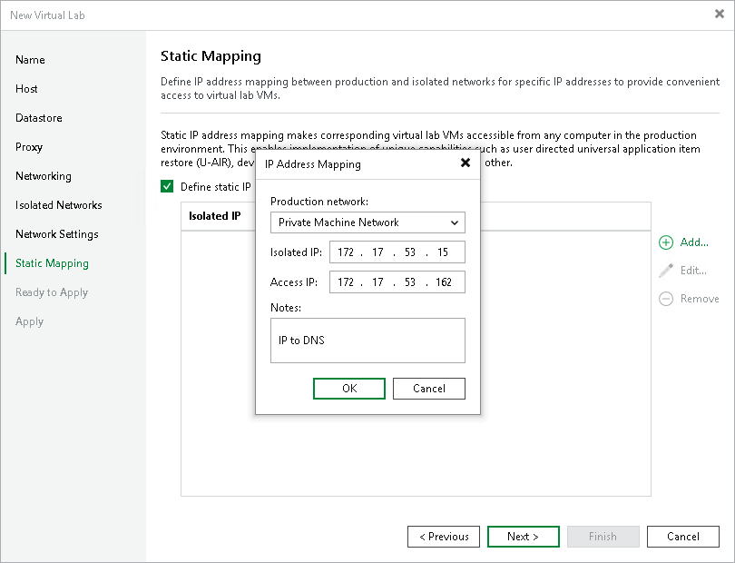

# Step 9. Specify Static IP Mapping Rules

The Static Mapping step of the wizard is available if you have selected the advanced networking option at the [Networking](vlab_network_vm.md) step of the wizard.

At the Static Mapping step of the wizard, you can specify static IP address mapping rules to make VMs in the virtual lab accessible from any machine in the production network.

To add a new rule:

1. Select the Define static IP address mapping check box.
2. Click Add.
3. If you have both IPv4 and IPv6 enabled, select the required address mapping.
4. In the IP Address Mapping window, specify settings of a new rule:

1. From the Production network drop-down list, select a production network in which a VM from the application group or verified VM resides.
2. In the Isolated IP field, specify the IP address of the VM in the production network.
3. In the Access IP field, specify the IP address in the production network that you want to use to access the VM in the virtual lab. You must use an IP address that is not allocated to any machine yet.

|  |
| --- |
| Note |
| It is recommended that you assign an access IP from the same subnet where the proxy appliance resides. In the opposite case, you will have to configure routing rules for the access IP manually. |

For example, a DNS server that you plan to start in the virtual lab has IP address 172.17.53.15 in the production network. To set static mapping for the DNS server:

1. In the Isolated IP field, you must define its production IP address — 172.17.53.15.
2. In the Access IP field, you must define any free IP address from the production network, for example, 172.17.53.162.

After a virtual lab is created and VMs are started in the virtual lab, you will be able to access the DNS server in the virtual lab from the production environment by IP address 172.17.53.162.

