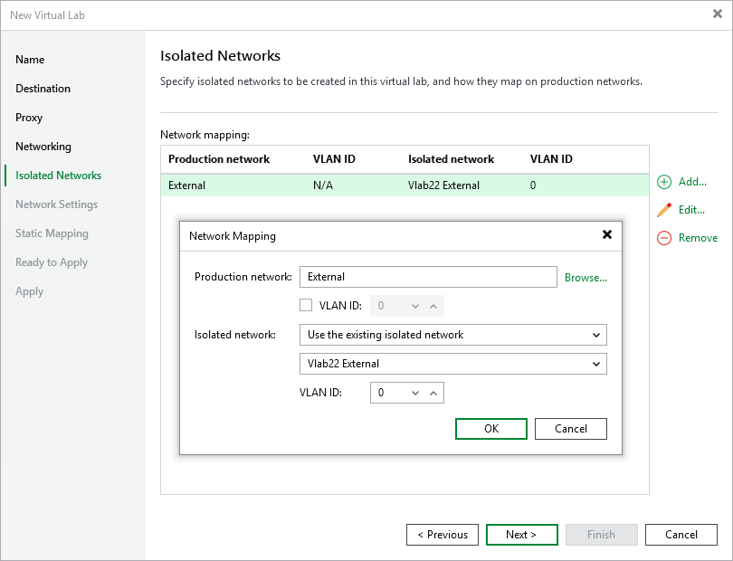

# Step 6. Select Isolated Networks

In this article

The Isolated Networks step of the wizard is available if you have selected the advanced networking option at the [Networking](vlab_network_hv.md) step of the wizard.

At the Isolated Networks step of the wizard, you must create isolated networks to which verified VMs and VMs from the application group will be connected and map these networks to production networks where original VMs are located. We recommend that you use unique VLAN ID for every isolated network.

You can configure two types of mapping rules:

* [Mapping rules for networks without VLANs](vlab_isolated_network_hv.md#novlan)
* [Mapping rules for networks with VLANs](vlab_isolated_network_hv.md#vlan)

Mapping Rules for Networks Without VLANs

To add a network:

1. Click Add.
2. From the Production network list, select a production network in which VMs from the application group or verified VMs reside.
3. In the Isolated network field, specify a name for an isolated network that must be mapped to this production network. You can specify a new name to create a new isolated network or select the existing isolated network from the drop-down list.
4. In the VLAN ID field, enter an ID for the created isolated network.

|  |
| --- |
| Note |
| You can map several production networks to the same isolated network. The production networks that you plan to map must have the same network masks and pools of IP addresses. |

Mapping Rules for Networks with VLANs

If you use VLANs in your production network, you can create several isolated networks and map them to different VLANs. As a result, the networking scheme in the virtual lab will resemble the networking scheme in your production environment.

To create mapping rules for a network with several VLANs:

1. Click Add.
2. From the Production network list, select a production network in which the VLAN you want to map is created.
3. In the VLAN ID field, specify an ID of the VLAN in the production network.
4. In the Isolated network field, specify a name for an isolated network that you want to map to the VLAN. You can specify a new name to create a new isolated network or select the existing isolated network from the drop-down list.
5. In the VLAN ID field, enter an ID for this isolated network.
6. Repeat steps 1-5 for every VLAN in your production network.

For example, you have 3 VLANs in your production networks: VLAN 100, VLAN 200 and VLAN 300. In this case, you can create 3 isolated networks and map them to VLANs in the following way:

* Isolated network 1 is mapped to VLAN 100
* Isolated network 2 is mapped to VLAN 200
* Isolated network 3 is mapped to VLAN 300

In the virtual lab, Veeam Backup & Replication will create 3 isolated networks and 3 virtual switches for these networks and connect VMs to necessary virtual switches. VMs in the virtual lab will function as they function in the production environment.

Page updated 9/3/2025

Page content applies to build 13.0.1.1071
