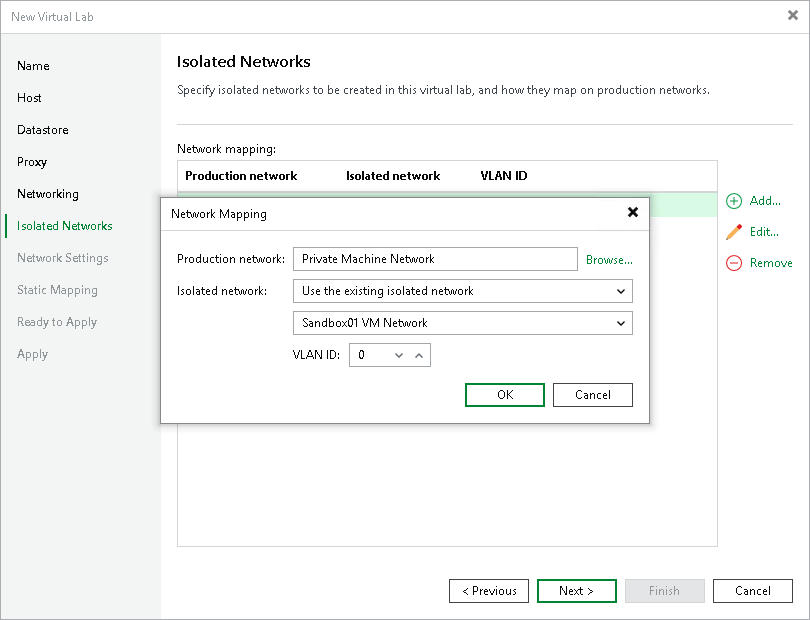

# Step 7. Create Isolated Networks

The Isolated Networks step of the wizard is available if you have selected the advanced networking option at the [Networking](vlab_network_vm.md) step of the wizard.

At the Isolated Networks step of the wizard, you must configure isolated networks to which verified VMs and VMs from the application group will be connected and map these networks to production networks where original VMs are located.

To add a network:

1. Click Add.
2. From the Production network list, select a production network in which a VM from the application group or verified VM resides.
3. In the Isolated network field, specify a name for the isolated network that must be mapped to the selected production network. You can specify a new name to create a new isolated network or select the existing isolated network from the drop-down list.
4. In the VLAN ID field, enter an ID for the created network. In the advanced multi-host virtual lab, VLAN IDs help ensure that the created network is isolated from the production environment. Alternatively, you can manually connect the DVS that you plan to use to the isolated network. For more information, see [Advanced Multi-Host Virtual Labs](surereplica_advanced_mutihost.md).

|  |
| --- |
| Important |
| Consider the following:   * Isolated network names cannot contain the following symbols: ~`!@#$%^&\*+=;'><|?\*:". Otherwise, Veeam Backup & Replication will return an error. For more information, see [this Veeam KB article](https://www.veeam.com/kb2074). * You can map several production networks to the same isolated network. The production networks that you plan to map must have the same network masks and pools of IP addresses. * You cannot map one production network to several isolated networks. * You can assign only up to 9 isolated networks per virtual lab. |

