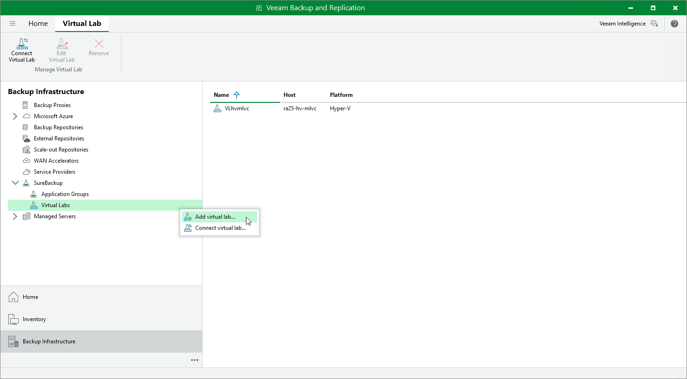

# Step 1. Launch New Virtual Lab Wizard

In this article

To launch the New Virtual Lab wizard, do one of the following:

* Open the Backup Infrastructure view, in the inventory pane select SureBackup. In the working area, click Add Virtual Lab > Hyper-V.
* Open the Backup Infrastructure view, in the inventory pane select Virtual Labs under SureBackup and click Add Virtual Lab > Microsoft Hyper-V.
* Open the Backup Infrastructure view, in the inventory pane right-click Virtual Labs under SureBackup and select Add Virtual Lab > Microsoft Hyper-V.

Page updated 9/3/2025

Page content applies to build 13.0.1.1071
