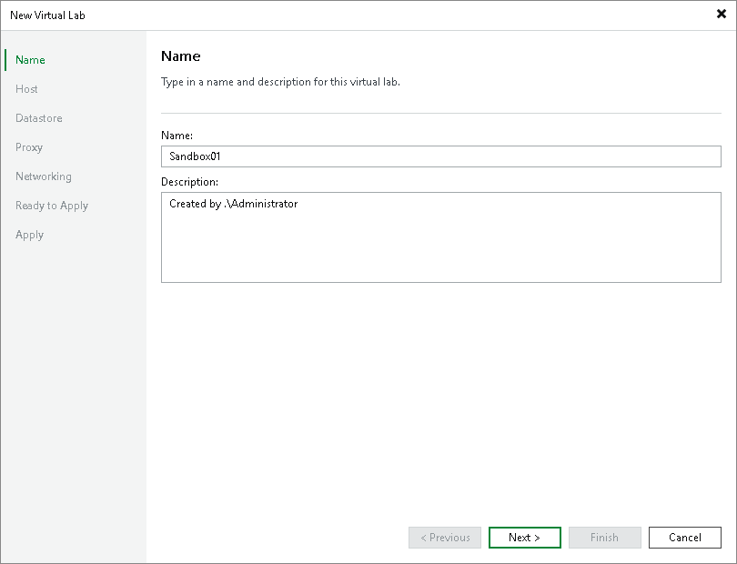

# Step 2. Specify Virtual Lab Name and Description

In this article

At the Name step of the wizard, specify a name and description for the virtual lab.

1. In the Name field, enter a name for the virtual lab.
2. In the Description field, provide a description for future reference. The default description contains information about the user who created the virtual lab, date and time when the lab was created.

Page updated 9/2/2025

Page content applies to build 13.0.1.1071
