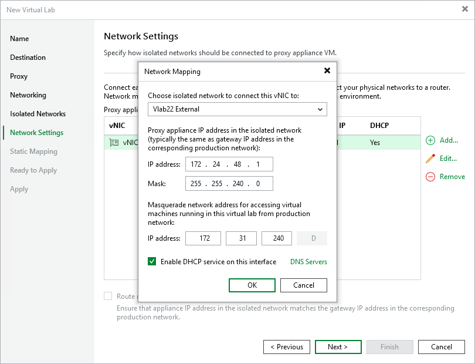

# Step 7. Specify Network Settings

The Network Settings step of the wizard is available if you have selected the advanced networking option at the [Networking](vlab_network_hv.md) step of the wizard.

At the Network Settings step of the wizard, you must specify settings for every created isolated network and define how production networks map to isolated networks in the virtual lab.

Communication between production networks and isolated networks is carried out through network adapters that are added to the proxy appliance. A new network adapter must be added for every isolated network. If you are planning to use IPv4 and IPv6 in your virtual lab, you must create a vNIC for each protocol.

To add a network adapter for an isolated network:

1. At the Network Settings step of the wizard, click Add.
2. If you have both IPv4 and IPv6 enabled, select the required IP address.
3. Select a network to which the network adapter must be connected. Specify an IP address that the proxy appliance must have in the isolated network and a subnet mask or prefix length of this isolated network. For IPv6, specify a prefix length instead of a subnet mask. Typically, the IP address for the proxy appliance coincides with the IP address of the gateway in the production network.
4. After you specify the IP address, Veeam Backup & Replication will automatically configure a masquerade IP address for accessing VMs in the virtual lab from the production network. You can change the masquerade network IP address if necessary.
5. Select the Enable DHCP service on this interface check box if you need to dynamically assign IP addresses for machines. The assigned IP addresses belong to the current isolated network.
6. Click the DNS Servers button and specify settings of a virtualized DNS server if necessary. Click OK.
7. To enable communication between isolated networks, select the Route network traffic between vNICs check box. Make sure that the IP address of the proxy appliance in the isolated network matches the IP address of the gateway in the production network.

|  |
| --- |
| Important |
| Consider the following:   * You cannot assign more than one vNIC to a single isolated network for each protocol. * Network addresses specified for different vNIC adapters must belong to different networks. For example, if the first network adapter has the 192.168.0.1 IP address and the network mask is 255.255.255.0, and the second one — 192.168.0.2 and the network mask is 255.255.255.0, such configuration will not work. In this situation, you need to assign to the second adapter an IP address from a different network, for example, 172.16.0.1.  * If you assign more than 1 network adapter (or IP address) to one production VM, Veeam Backup & Replication will apply the predefined tests only to one of these IP addresses. For more information on the predefined tests, see [Predefined tests](predefined_tests_hv.md). |

