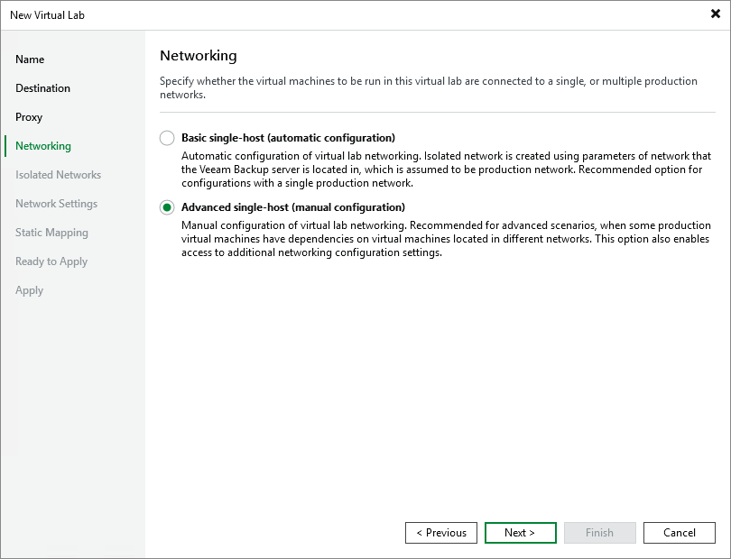

# Step 5. Select Networking Mode

In this article

At the Networking step of the wizard, select the type of network settings configuration. Veeam Backup & Replication offers two networking modes for the virtual lab:

* Basic single-host. This networking mode is recommended if all VMs that you plan to verify, VMs from the application group and the backup server are located in the same production network. In this case, Veeam Backup & Replication will automatically define all networking settings for the virtual lab.
* Advanced single-host. This networking mode is recommended if VMs that you plan to verify or VMs from the application group are located in different networks. In this case, you will have to manually define settings for isolated networks in the virtual lab.

If this option is selected, the New Virtual Lab wizard will include additional steps for customizing network settings.

Page updated 9/3/2025

Page content applies to build 13.0.1.1071
