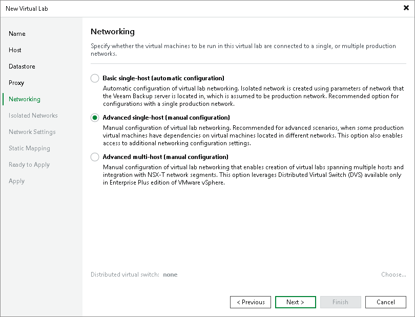
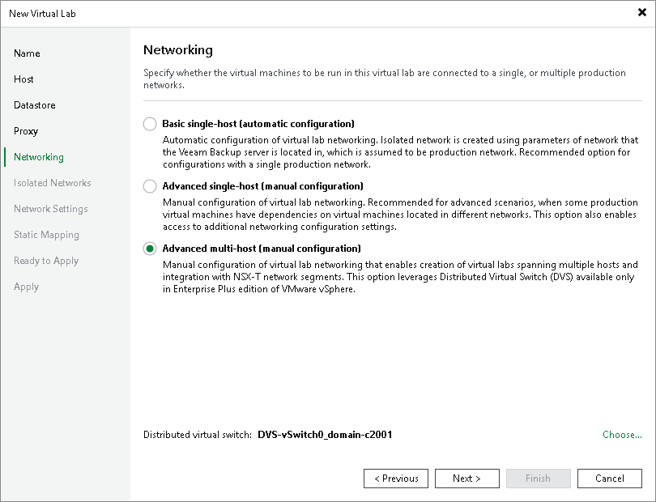

# Step 6. Select Networking Mode

In this article

At the Networking step of the wizard, select the type of network settings configuration. The virtual lab configuration depends on objects that you plan to verify in the virtual lab:

* [Backups](vlab_network_vm.md#backup)
* [Replicas](vlab_network_vm.md#replica)
* [VMs from storage snapshots](vlab_network_vm.md#snapshot)

Selecting Networking Mode for Verifying Backups

Veeam Backup & Replication offers two networking modes for the virtual lab in which VMs from backups can be verified:

* Basic single-host. This networking mode is recommended if all VMs that you plan to verify, VMs from the application group and the backup server are located in the same production network. In this case, Veeam Backup & Replication will automatically define all networking settings for the virtual lab.

* Advanced single-host. This networking mode is recommended if VMs that you plan to verify and VMs from the application group are located in different networks. In this case, you will have to manually define settings for isolated networks in the virtual lab.

If you select the Advanced single-host option, the New Virtual Lab wizard will include additional steps for customizing network settings.

|  |
| --- |
| Note |
| You can also verify VM backups in Advanced Multi-Host virtual labs with DVS. This scenario can be helpful if you want to test VM backups and replicas in the same virtual lab or want to add verified VM backups and replicas to the same SureBackup job. |

Selecting Networking Mode for Verifying Replicas

Veeam Backup & Replication offers three networking modes for the virtual lab in which VM replicas are verified:

* Basic single-host. This type of networking is recommended if VM replicas that you plan to verify are located on the same ESXi host and are connected to the same production network. The backup server must also be located in this network. In this case, Veeam Backup & Replication will automatically define all networking settings for the virtual lab.
* Advanced single-host. This type of networking is recommended if VM replicas that you plan to verify are located on the same ESXi host but connected to different networks. In this case, you will have to manually define settings for isolated networks in the virtual lab.
* Advanced multi-host. This type of networking is recommended if VM replicas that you plan to verify are located on the different ESXi hosts. For multi-host configuration of the virtual lab, Veeam Backup & Replication uses VMware DVS technology.

If you select the Advanced multi-host option, click Choose and select the necessary DVS in your virtual environment. Note that Veeam Backup & Replication does not configure DVS automatically: you must configure it beforehand.

You can use VMware NSX-T 3.0 or later as isolated or production networks in Advanced multi-host networking mode. In this case, you must configure DVS and NSX-T networks beforehand.

If the Advanced single-host or Advanced multi-host option is selected, the New Virtual Lab wizard will include additional steps for customizing network settings.

|  |
| --- |
| Important |
| For every isolated network in the virtual lab, Veeam Backup & Replication adds a new port group to the DVS. If you use a production DVS, you must isolate port groups created by Veeam Backup & Replication from the production environment. For more information, see [Isolated Networks on DVS](surereplica_advanced_mutihost_networks.md). |

Selecting Network Mode for Verifying VMs on Storage Snapshots

For verifying VMs from storage snapshots, you can select any networking mode.

Page updated 9/2/2025

Page content applies to build 13.0.1.1071
