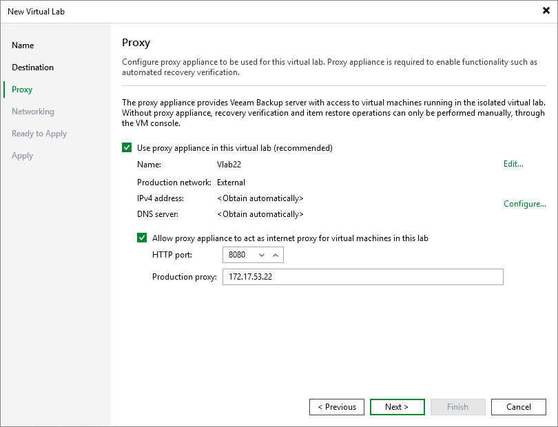

# Step 4. Set Up Proxy Appliance

In this article

At the Proxy step of the wizard, configure the proxy appliance settings.

1. Select the Use proxy appliance in this virtual lab check box to enable automatic recovery verification of VMs. The proxy appliance acts as a gateway that provides access from the backup server to VMs in the virtual lab. If you do not select this check box, during recovery verification Veeam Backup & Replication will only start VMs in the virtual lab and perform the heartbeat test for VMs. You will have to manually test VMs or perform manual item-level restore using the VM console.
2. By default, the proxy appliance uses the virtual lab name that you have specified at the Name step of the wizard. If you want to change a name of the proxy appliance, a production network or production network VLAN ID, click Edit and specify the necessary settings.
3. Click Configure and select a production network in which the proxy appliance will be created. Select IPv4 or IPv6 or use both. Specify an IP address for the proxy appliance in the production network and settings of the DNS server to be used. You can choose to automatically obtain an IP address and DNS server settings or set them manually.

|  |
| --- |
| Important |
| Consider the following:   * If you assign to the proxy appliance an IP address from the same network where the backup server is located, Veeam Backup & Replication will automatically add a new route to the routing table on the backup server. If you assign to the proxy appliance an IP address from a different network, you will have to manually add a new route to the routing table on the router in the production network. If you do not add a new route, tests and application scripts will fail and you will not be able to access VMs in isolated networks. * When Veeam Backup & Replication starts a virtual lab, it verifies if the proxy appliance is available by sending a ping request to it. If the required route is not added to the routing table, the SureBackup job will fail.  * You cannot edit the production network after you create the virtual lab. |

1. If you want to let VMs in the virtual lab access the internet, select the Allow proxy appliance to act as internet proxy for virtual machines in this lab check box. In the Port field, specify a port for HTTP traffic. By default, port 8080 is used. In the Production proxy field, you can optionally specify an IP address or a fully qualified domain name of an Internet-facing proxy server that VMs must use to access the Internet.
2. Adjust proxy settings in the Internet options on every VM that you plan to start in the virtual lab. To do this, on the VM open Internet Options > Connections > LAN Settings > Proxy server and specify the IP address of the proxy appliance on the isolated network and port number.

|  |
| --- |
| Note |
| When you allow the proxy appliance to act as an internet proxy, you enable the HTTP(S) internet access for VMs in the virtual lab. The proxy appliance does not proxy other protocols (such as ICMP protocol used for ping tests) for VMs in the virtual lab. |

Page updated 9/3/2025

Page content applies to build 13.0.1.1071
