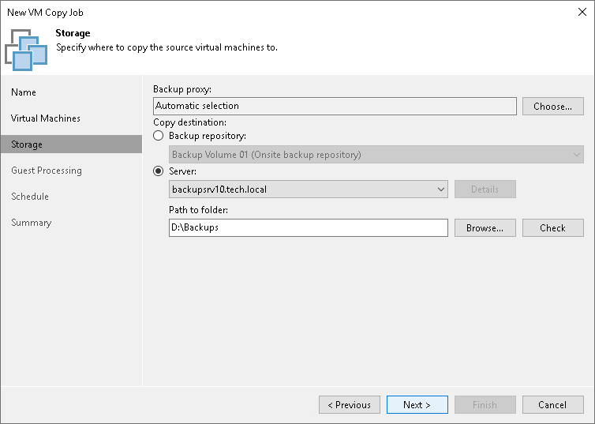

# Step 5. Specify Copy Destination

At the Storage step of the wizard, select which backup proxy must be used for VM data transporting and specify the destination for the VM copy.

1. Click Choose next to the Backup proxy field to select a backup proxy.

+ If you choose Automatic selection, Veeam Backup & Replication will detect backup proxies that have access to the source datastore and automatically assign an optimal backup proxy for processing VM data.

Veeam Backup & Replication assigns backup proxies to VMs included in the VM copy job one by one. Before processing a new VM in the VM list, Veeam Backup & Replication checks available backup proxies. If more than one backup proxy is available, Veeam Backup & Replication analyzes transport modes that the backup proxies can use for data retrieval and the current workload on the backup proxies to select the most appropriate one for VM processing.

+ If you choose Use the selected backup proxy servers only, you can explicitly select backup proxies that the job must use. It is recommended that you select at least two backup proxies to ensure that the VM copy job starts if one of the proxies fails or loses its connectivity to the source datastore.

1. In the Copy destination section, select a location where the created VM copy must be stored.

+ Select a backup repository from the list if you want to create a VM copy in the backup repository configured in the backup infrastructure. When you select a backup repository, Veeam Backup & Replication automatically checks how much free space is available on it.

|  |
| --- |
| Important |
| You cannot use a [scale-out backup repository](backup_repository_sobr.md) as the copy destination. |

+ Select Server if you want to store the VM copy on a disk or storage device attached to the server. From the Server list, select a server added to the backup infrastructure. In the Path to folder field, specify a folder on the server where the created VM copy must be stored.

Use the Check button to see how much free space is available in the target location.

