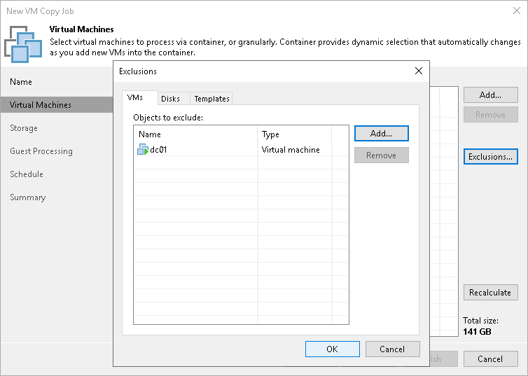
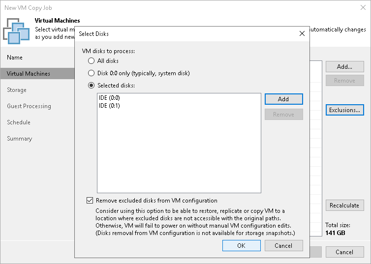
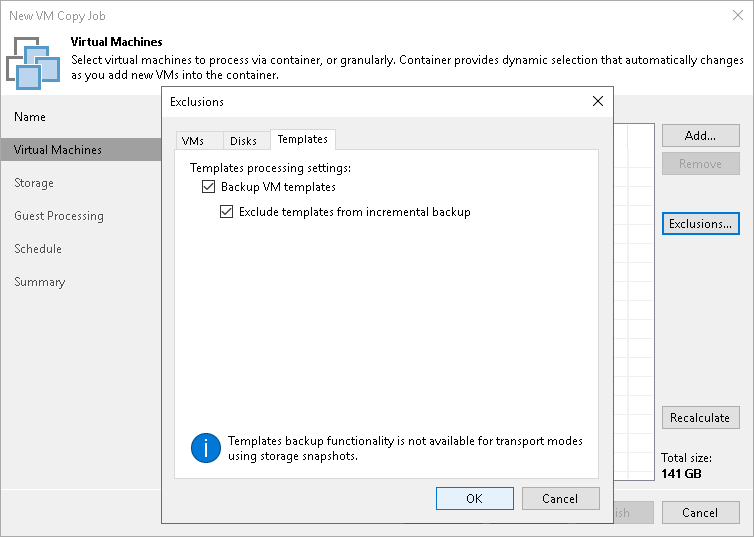

# Step 4. Exclude Objects from VM Copy Job

In this article

After you have added VMs and VM containers to the job, you can specify which objects you want to exclude from the VM copy. You can exclude the following types of objects:

* [VMs from VM containers](#vm)
* [Specific VM disks](#disks)
* [VM templates](#template)

|  |
| --- |
| Note |
| Veeam Backup & Replication automatically excludes VM log files from VM copies to make copying process faster and reduce the size of the resulting file. |

To exclude VMs from a VM container:

1. At the Virtual Machines step of the wizard, select a VM container added to the job and click Exclusions.
2. Click the VMs tab.
3. Click Add.
4. Use the toolbar at the top right corner of the window to switch between views: Hosts and Clusters, VMs and Templates, Datastores and VMs and Tags. Depending on the view you select, some objects may not be available. For example, if you select the VMs and Templates view, no resource pools, hosts or clusters will be displayed in the tree.
5. In the displayed tree, select the necessary object and click Add. Use the Show full hierarchy check box to display the hierarchy of all VMware Servers added to Veeam Backup & Replication.
6. Click OK.

To exclude VM disks:

1. At the Virtual Machines step of the wizard, select a VM or VM container added to the job and click Exclusions.
2. Click the Disks tab.
3. Select the VM in the list and click Edit. If you want to exclude disks of a VM added as a part of the container, click Add to include the VM in the list as a standalone object.
4. Choose disks that you want to copy. You can choose to process all disks, 0:0 disks (typically, the system disks) or add to the list custom IDE, SCSI or SATA disks.
5. Select the Remove excluded disks from VM configuration check box. Veeam Backup & Replication will modify the VMX file of a copied VM to remove excluded disks from the VM configuration. If you use the VM copy to register the VM in a location where excluded disks are not accessible with the original paths, you will not have to manually edit the VM configuration file to be able to power on the VM.

To exclude VM templates:

1. At the Virtual Machines step of the wizard, select a VM or VM container added to the job and click Exclusions.
2. Click the Templates tab.
3. Clear the Backup VM templates check box.
4. If you want to include VM templates into the full VM copy only, leave the Backup VM templates check box selected and select the Exclude templates from incremental backup check box.

Page updated 5/26/2023

Page content applies to build 13.0.1.1071
