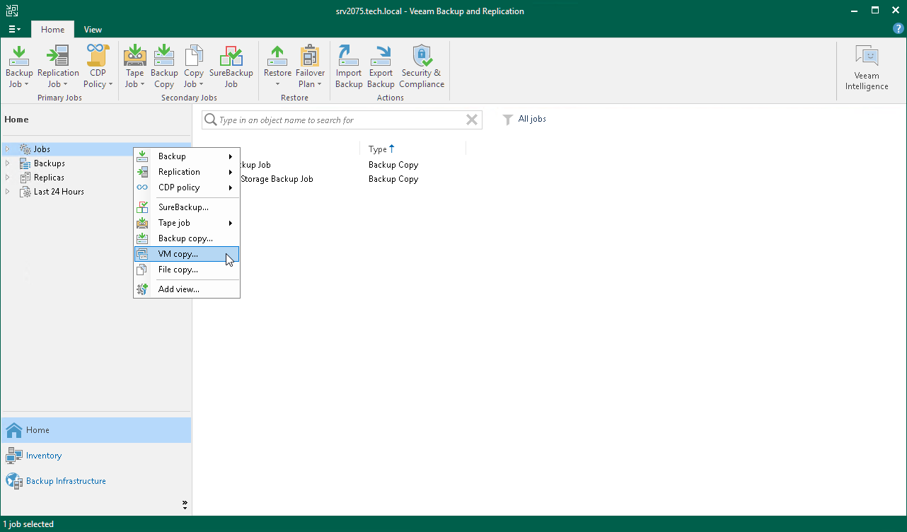

# Step 1. Launch VM Copy Job Wizard

To run the VM Copy Job wizard, do either of the following:

* On the Home tab, click Copy Job > Virtual machine.
* Open the Home view. In the inventory pane, right-click Jobs and select VM Copy.
* Open the Inventory view, in the working area select the VMs, click Add to VM Copy on the ribbon and select New job or right-click the VMs area and select Add to VM copy job > New job. In this case, the selected VMs will be automatically added to the VM copy job. You can add other VMs to the job when passing through the wizard steps.
* You can quickly add the VMs to an already existing job. To do this, open the Inventory view, in the working area select the VMs and click Add to VM Copy > name of the job on the ribbon or right-click the VMs and select Add to VM copy job > name of the job.

