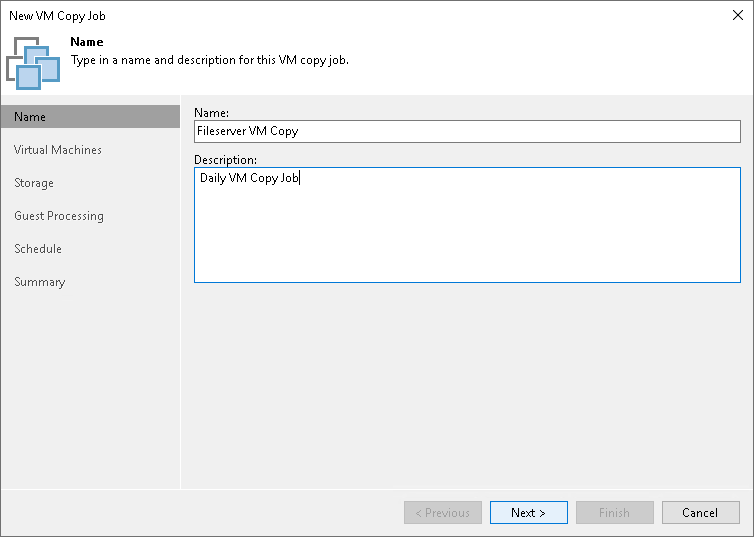

# Step 2. Specify Job Name and Description

In this article

At the Name step of the wizard, specify a name and description for the VM copy job.

1. In the Name field, enter a name for the VM copy job.
2. In the Description field, provide a description for future reference. The default description contains information about the user who created a job, date and time when the job was created.

Page updated 1/25/2024

Page content applies to build 13.0.1.1071
