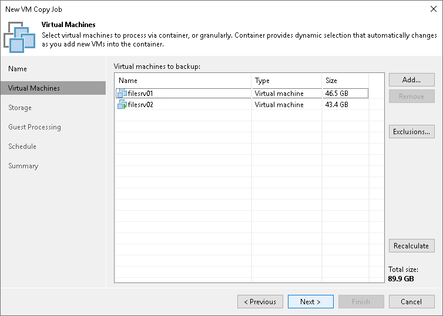

# Step 3. Select VMs to Copy

In this article

At the Virtual Machines step of the wizard, select VMs and VM containers (hosts, clusters, folders, resource pools, VirtualApps, datastores or tags) that you want to copy.

Jobs with VM containers are dynamic in their nature. If a new VM is added to the container in the virtual infrastructure after the VM copy job is created, Veeam Backup & Replication will automatically update the job settings to include the added VM.

1. Click Add.
2. Use the toolbar at the top right corner of the window to switch between views: Hosts and Clusters, VMs and Templates, Datastores and VMs and Tags. Depending on the view you select, some objects may not be available. For example, if you select the VMs and Templates view, no resource pools, hosts or clusters will be displayed in the tree.
3. Select the object and click Add.

To quickly find the necessary object, you can use the search field at the bottom of the Add Objects window.

1. Click the button to the left of the search field and select the necessary type of object to search for: Everything, Folder, Cluster, Host, Resource pool, VirtualApp or Virtual machine.
2. Enter the object name or a part of it in the search field.
3. Click the Start search button on the right or press [Enter] on the keyboard.

The initial size of VMs and VM containers added to the VM copy job is displayed in the Size column in the list. The total size of objects is displayed in the Total size field. Use the Recalculate button to refresh the total size value after you add a new object to the job.

Page updated 1/15/2026

Page content applies to build 13.0.1.1071
