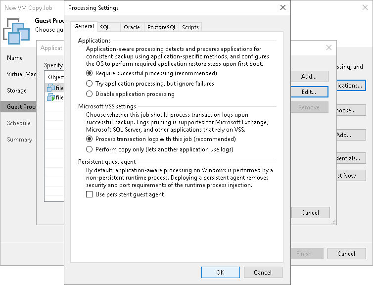

# Application-Aware Processing

In this article

If you add to the VM copy job VMs running VSS-aware applications, you can enable application-aware processing to create a transactionally consistent VM copy. The transactionally consistent VM copy guarantees proper recovery of applications on VMs without data loss.

To enable application-aware processing:

1. Select the Enable application-aware processing check box.
2. Click Applications.
3. In the displayed list, select the VM and click Edit.

To define custom settings for a VM added as a part of the VM container, you must include the VM in the list as a standalone object. To do this, click Add and choose a VM whose settings you want to customize. Then select the VM in the list and define the necessary settings.

1. On the General tab, in the Applications section specify the VSS behavior scenario:

* Select Require successful processing if you want Veeam Backup & Replication to stop the VM copy process if any VSS errors occur.
* Select Try application processing, but ignore failures if you want to continue the VM copy process even if VSS errors occur. This option is recommended to guarantee completion of the job. The created VM image will not be transactionally consistent but crash consistent.
* Select Disable application processing if you do not want to enable quiescence for the VM.

1. [For Microsoft Exchange, Microsoft SQL and Oracle VMs] In the Transaction logs section, specify if Veeam Backup & Replication must process transaction logs or copy-only VM copies must be created.

1. Select Process transaction logs with this job if you want Veeam Backup & Replication to process transaction logs.

[For Microsoft Exchange VMs] With this option selected, the non-persistent runtime components or persistent components running on the VM guest OS will wait for the VM copy job to complete successfully and then trigger truncation of transaction logs. If the VM copy job fails, the logs will remain untouched on the VM guest OS until the next start of the non-persistent runtime components or persistent components.

[For Microsoft SQL Server VMs and Oracle VMs] You will have to specify settings for transaction log handling on the SQL and Oracle tabs of the VM Processing Settings window. For more information, see [Microsoft SQL Server Transaction Log Settings](vm_copy_vss_transaction_sql.md) and [Oracle Archived Log Settings](vm_copy_vss_transaction_oracle.md).

1. Select Perform copy only if you use another backup tool to perform VM guest level backup or replication, and this tool maintains consistency of the database state. Veeam Backup & Replication will create a copy-only VM image for the selected VMs. The copy-only VM image preserves the chain of full/differential backup files and transaction logs on the VM. For more information, see [Microsoft Docs](http://msdn.microsoft.com/en-us/library/ms191495.aspx).

1. In the Persistent guest agent section, specify if Veeam Backup & Replication must use persistent guest agents on each protected VM for application-aware processing.

By default, Veeam Backup & Replication uses non-persistent runtime components. Veeam Backup & Replication deploys runtime components on each protected VM when the backup job starts, and removes the runtime components as soon as the backup job finishes.

Select the Use persistent guest agent check box to enable persistent agent components for guest processing. For more information, see [Non-Persistent Runtime Components and Persistent Agent Components](runtime_process.md).

Page updated 6/3/2024

Page content applies to build 13.0.1.1071
