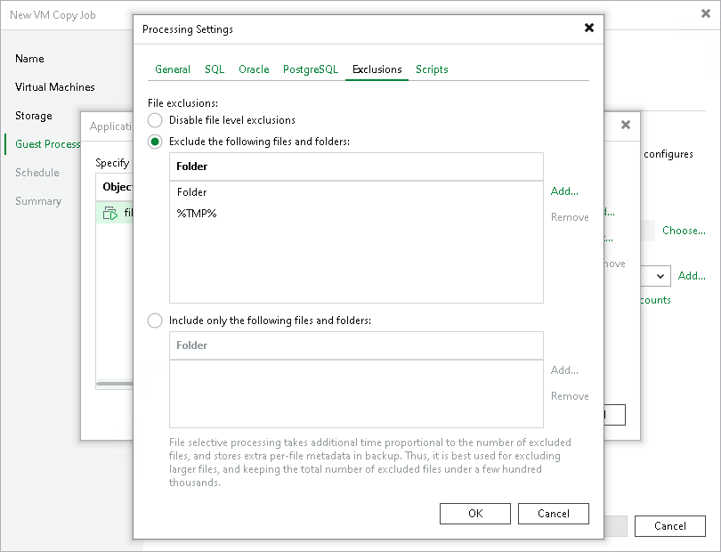

# VM Guest OS File Exclusion

If you do not want to copy specific files and folders on the VM guest OS, you can exclude them from the VM copy.

To specify excluded files and folders, do the following:

1. At the Guest Processing step of the wizard, click Application handling options for individual machines.
2. In the displayed list, select the VM and click Edit.
3. Click the Exclusions tab and specify what files must be excluded from the copy:

+ Select Exclude the following files and folders to remove the individual files and folders from the VM copy.
+ Select Include only the following files and folders to leave only the specified files and folders in the VM copy.

1. Click Add and specify what files and folders you want to include or exclude. To form the list of exclusions or inclusions, you can use full paths to files and folders, environmental variables and file masks with the asterisk (\*) and question mark (?) characters. For more information, see [VM Guest OS Files](guest_file_exclusion.md).

|  |
| --- |
| Note |
| When you choose files to be included or excluded, consider the requirements and limitations listed in the section [Requirements and Limitations for VM Guest OS File Exclusion](guest_file_exclusion.md#reqs). |

1. Click OK.

