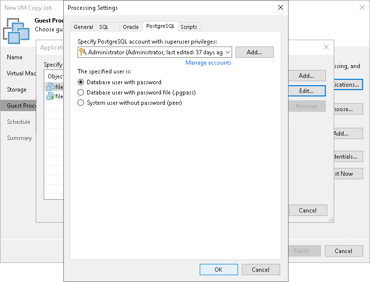

# PostgreSQL WAL Files Settings

In this article

To create a transactionally consistent backups of PostgreSQL VM, you must enable application-aware processing and define settings of WAL files processing.

Enabling Application-Aware Processing

Before configuring WAL files processing, check that application-aware processing is enabled:

1. At the Guest Processing step of the wizard, select the Enable application-aware processing check box.
2. Click Applications.
3. In the displayed list, select the PostgreSQL VM and click Edit.

Specifying WAL Files Settings

To define how Veeam Backup & Replication will process WAL files on this VM, do the following:

1. In the Processing Settings window, click the PostgreSQL tab.
2. From the Specify PostgreSQL account with superuser privileges drop-down list, select a user account that Veeam Backup & Replication will use to connect to the PostgreSQL instance. The account must have privileges described in section [Permissions](required_permissions.md#postgresql). If you have not set up credentials beforehand, click the Manage accounts link or click Add on the right to add credentials.

By default, the Use guest credentials option is selected in the list. With this option selected, Veeam Backup & Replication will connect to the PostgreSQL instance under the account In this case, Veeam Backup & Replication will use the account specified at the Guest Processing step of the wizard to access the VM guest OS and connect to the PostgreSQL instance.

Note that if you plan to select the System user without password file (peer) authentication method at the step 3 of this procedure, you can add a user account in the [Credentials Manager](credentials_manager.md) without specifying the password for the account.

1. In the Specified user is section, specify how the user will authenticate against the PostgreSQL instance:

* Select Database user with password if the account that you specified at the step 2 is a PostgreSQL account, and you entered the password for this account in the Credentials Manager.
* Select Database user with password file (.pgpass) if the password for the account that you specified at the step 2 is defined in the .pgpass configuration file on the PostgreSQL VM. For more information about the password file, see [PostgreSQL documentation](https://www.postgresql.org/docs/9.3/libpq-pgpass.html).
* Select System user without password file (peer) if you want Veeam Backup & Replication to use the peer authentication method. In this case, Veeam Backup & Replication will apply the OS account as the PostgreSQL account.

Page updated 6/3/2024

Page content applies to build 13.0.1.1071
