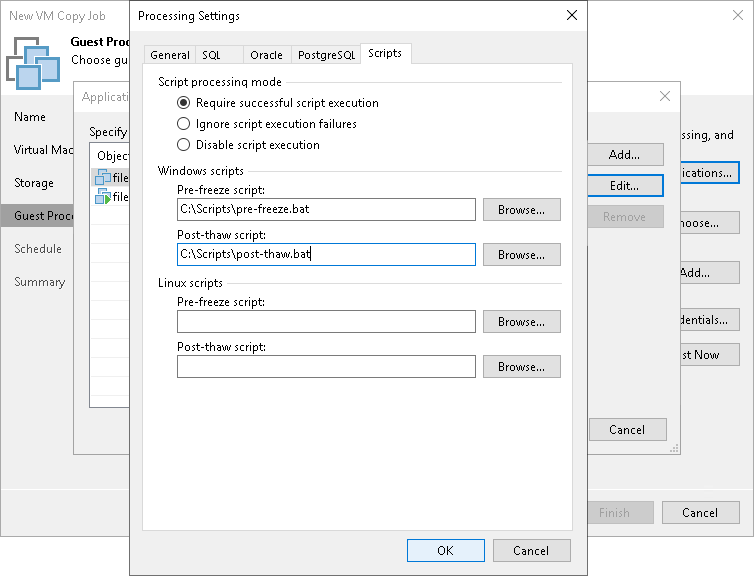

# Pre-Freeze and Post-Thaw Scripts

If you plan to copy VMs running applications that do not support VSS, you can instruct Veeam Backup & Replication to run custom pre-freeze and post-thaw scripts for these VMs. The pre-freeze script quiesces the VM file system and application data to bring the VM to a consistent state before Veeam Backup & Replication triggers a VM snapshot. After the VM snapshot is created, the post-thaw script brings the VM and applications to their initial state.

To specify pre-freeze and post-thaw scripts for the job:

1. At the Guest Processing step, click Applications.
2. In the displayed list, select the VM and click Edit.
3. Click the Scripts tab.
4. In the Script processing mode section, specify the scenario for scripts execution:

+ Select Require successful script execution if you want Veeam Backup & Replication to stop the VM copy process if the script fails.
+ Select Ignore script execution failures if you want to continue the VM copy process even if script errors occur.
+ Select Disable script execution if you do not want to run scripts for the VM.

1. In the Windows scripts section, specify paths to pre-freeze and post-thaw scripts for Microsoft Windows VMs. For the list of supported script formats, see [Pre-Freeze and Post-Thaw Scripts](pre_post_scripts.md).
2. In the Linux scripts section, specify paths to pre-freeze and post-thaw scripts for Linux VMs. For the list of supported script formats, see [Pre-Freeze and Post-Thaw Scripts](pre_post_scripts.md).

If you have added to the job a VM container with Microsoft Windows and Linux VMs, you can select to execute both Microsoft Windows and Linux scripts for the VM container. When the job starts, Veeam Backup & Replication will automatically determine what OS type is installed on the VM and apply required scripts to quiesce this VM.

