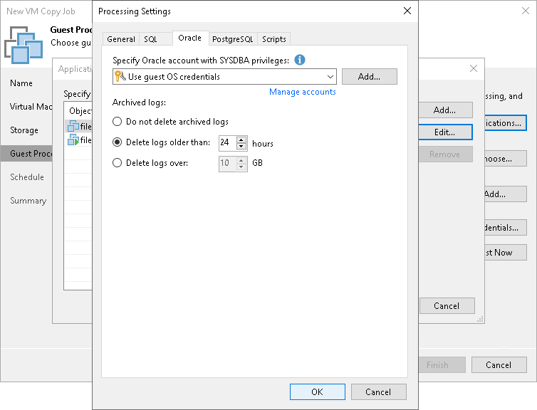

# Oracle Archived Log Settings

If you copy an Oracle VM, you can specify how Veeam Backup & Replication must process transaction logs:

1. At the Guest Processing step of the wizard, select the Enable application-aware processing check box.
2. Click Applications.
3. In the displayed list, select the Oracle VM and click Edit.
4. In the Transaction logs section, select Process transaction logs with this job.
5. In the VM Processing Settings window, click the Oracle tab.
6. In the Specify Oracle account with SYSDBA privileges section, specify a user account that Veeam Backup & Replication will use to connect to the Oracle database. The account must have SYSDBA rights on the Oracle database.

You can select Use guest credentials in the list of user accounts. In this case, Veeam Backup & Replication will use the account specified at the Guest Processing step of the wizard to access the VM guest OS and connect to the Oracle database.

1. In the Archived logs section, specify if Veeam Backup & Replication must truncate transaction logs on the Oracle VM:

* Select Do not truncate archived logs if you want Veeam Backup & Replication to preserve archived logs on the VM guest OS. When the VM copy job completes, the non-persistent runtime components or persistent components will not truncate transaction logs.

It is recommended that you select this option for databases for which the ARCHIVELOG mode is turned off. If the ARCHIVELOG mode is turned on, transaction logs on the VM guest OS may grow large and consume all disk space. In this case, the database administrators must take care of transaction logs themselves.

* Select Truncate logs older than <N> hours or Truncate logs over <N> GB if you want Veeam Backup & Replication to truncate archived logs that are older than <N> hours or larger than <N> GB. The non-persistent runtime components or persistent components running on the VM guest OS will wait for the VM copy job to complete successfully and then trigger transaction logs truncation using Oracle Call Interface (OCI). If the job does not manage to copy the Oracle VM, the logs will remain untouched on the VM guest OS until the next start of the non-persistent runtime components or persistent components.

