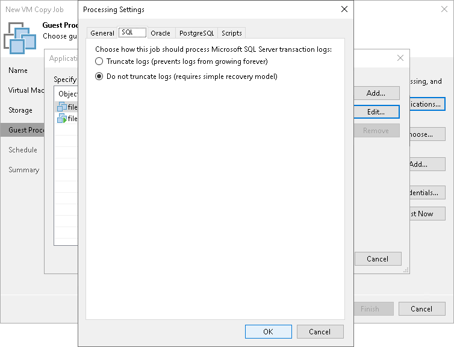

# Microsoft SQL Server Transaction Log Settings

In this article

If you copy a Microsoft SQL VM, you can specify how Veeam Backup & Replication must process transaction logs:

1. At the Guest Processing step of the wizard, select the Enable application-aware processing check box.
2. Click Applications.
3. In the displayed list, select the Microsoft SQL Server VM and click Edit.
4. In the Transaction logs section, select Process transaction logs with this job.
5. In the VM Processing Settings window, click the SQL tab.
6. Specify how transaction logs must be processed:

* Select Truncate logs if you want Veeam Backup & Replication to trigger truncation of transaction logs only after the job completes successfully. In this case, the non-persistent runtime components or persistent components will wait for the job to complete and then trigger truncation of transaction logs. If the VM copy job fails, the logs will remain untouched on the VM guest OS until the next start of the non-persistent runtime components or persistent components.
* Select Do not truncate logs if you do not want Veeam Backup & Replication to truncate logs at all. This option is recommended if you are using another backup tool to perform VM guest-level backup or replication, and this tool maintains consistency of the database state. In such scenario, Veeam Backup & Replication will not trigger transaction log truncation. After you fail over to the necessary restore point of the VM copy, you will be able to apply transaction logs to get the database system to the necessary point in time between VM copy job sessions.

Page updated 5/26/2023

Page content applies to build 13.0.1.1071
