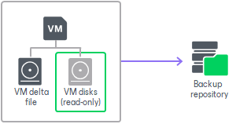
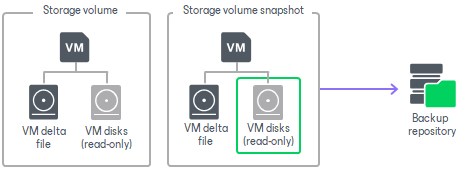

# VM Data Processing

Veeam Backup & Replication supports an accelerated procedure of creating backups for VMs that host their disks on storage systems. This section describes differences between regular data processing and backup from storage snapshots.

Regular VM Data Processing

In the regular processing course, Veeam Backup & Replication uses a VMware snapshot. The VMware snapshot “freezes” the VM state and data at a specific point in time. This way, the VM data is brought to a consistent state suitable for backup or replication.

During regular VM data processing, Veeam Backup & Replication performs the following actions:

1. Triggers a VMware snapshot for a VM. VM disks are put to the read-only state, and every virtual disk of the VM receives a delta file named like vmname-00001.vmdk.
2. Copies VM data from read-only disks of the VM. All changes that the user makes to the VM while backup or replication is performed are written to delta files.
3. When VM processing is finished, the VMware snapshot is committed. VM disks resume writes, and data from delta files is merged to the VM disks. After data is merged, the VMware snapshot is removed.

Regular VM data processing may take long. If backup or replication is performed for a VM running a highly transactional application, the delta file may grow large. The snapshot commit process will take much time, and the VM may hang up during this process. To overcome this situation, you can use backup from storage snapshots.

Backup from Storage Snapshots

Backup from storage snapshots lets you speed up backup and replication operations. For backup from storage snapshots, Veeam Backup & Replication complements the VMware snapshot technology with the storage snapshots technology, and uses storage snapshots as a source of data for backup and replication. These storage snapshots are temporary and are removed after backup or replication finishes.

During backup from storage snapshots, Veeam Backup & Replication performs the following actions:

1. Veeam Backup & Replication triggers a VMware snapshot for VMs whose disks are hosted on the storage system.
2. Veeam Backup & Replication triggers a temporary storage snapshot of the volume or LUN hosting the VM itself and the created VMware snapshot.
3. The VMware vSphere VM snapshot on the original storage volume is deleted immediately after the temporary storage snapshot is created. Veeam Backup & Replication accesses the "cloned" VMware snapshot on the temporary storage snapshot and copies VM data from it.
4. When VM processing is finished, the temporary storage snapshot capturing the VMware snapshot is removed.

As a result, the VMware snapshot exists for a very short time, namely several seconds. Delta files do not grow large, and the time of VMware snapshot commit decreases.

