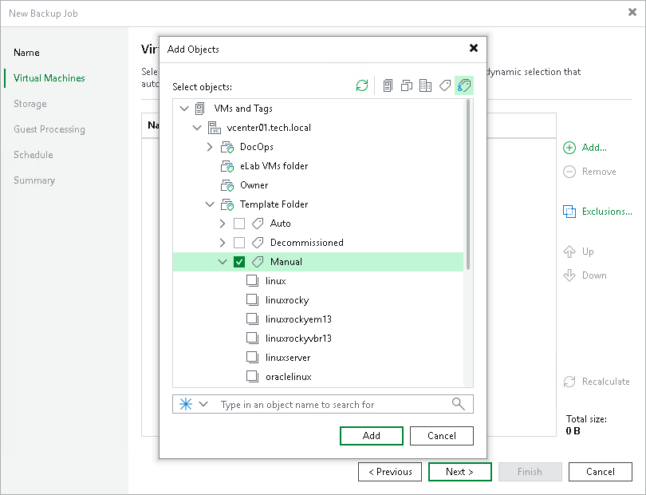

# VM Tags

In this article

If you use vCenter Server tags to categorize objects in the virtual infrastructure, you can filter objects that you add to data protection and disaster recovery jobs and tasks by these tags. Use of tags facilitates object management. You can quickly configure jobs and tasks for VMs that belong to a specific category, for example, a certain department or SLA level.

To add objects by tags, switch to the VMs and Tags or Tag combination view in the Add Objects window. Veeam Backup & Replication will display objects categorized by tags.

In the VMs and Tags view, you can select only one tag and those objects that have this tag will be processed by a job. In the Tags combination view, you can select multiple tags and those object that have all the selected tags will be processed.

Requirements and Recommendations for VM Tags

When you work with tags in Veeam Backup & Replication, consider the following requirements and recommendations:

* The VirtualCenter.FQDN parameter in the Advanced Settings of vCenter Server must contain the real fully qualified domain name of the vCenter Server host.
* A certificate installed on vCenter Server must contain the real fully qualified domain name of the vCenter Server host.
* The fully qualified domain name of the vCenter Server host must be accessible and resolved to its IP (and vice versa) from machines on which Veeam Backup & Replication services are installed (at least the Veeam Backup Service and Veeam Broker Service).
* A user account used for specific data protection and disaster recovery operations must have sufficient permissions on the vCenter Server. For more information, see [Full VM Restore](https://helpcenter.veeam.com/docs/vbr/permissions/vmrestore.html?ver=13), [Replica Failback](https://helpcenter.veeam.com/docs/vbr/permissions/replicafailback.html?ver=13) and [Cumulative Permissions](https://helpcenter.veeam.com/docs/vbr/permissions/cumulativepermissions.html?ver=13) sections in the Permissions Reference.
* If VM tags are not displayed in the Veeam Backup & Replication console for some reason, try restarting VMware vSphere services that are responsible for the tags functionality. In VMware vSphere earlier than 6.5, you must restart the vCenter Inventory Service. Starting from VMware vSphere 6.5, vCenter Inventory Services functionality is replaced by the vCenter Content Library and other services that are part of vCenter Server 6.5.

When you upgrade to VMware vSphere 6.5, data from vCenter Inventory Service is migrated to the new database support services in vCenter Server 6.5. The vCenter Inventory Service may remain in the list of services, however, it is no longer used.

* If you are using the vSphere Fault Tolerance feature, assign VM tags in one of the following ways to provide proper VM backup processing by Veeam Backup & Replication:

* Assign the required VM tag to the primary VM. In case of the failover to the secondary VM, the VM tag is copied to the secondary VM and this VM is used as a source for continuing Veeam Backup & Replication jobs.
* Assign the required VM tag to the VM container that comprises the primary VM in the virtual infrastructure inventory. The primary VM inherits this tag. In case of the failover to the secondary VM, the VM tag is copied to the secondary VM and this VM is used as a source for continuing Veeam Backup & Replication jobs.

Thus, there is no need to assign the VM tag to the secondary VM. Moreover, if you manually assign the same tag both to the primary VM and the secondary VM and use this tag to add objects to a VM backup job, this will result in the backup failure.

Limitations for VM Tags

The VM tags support functionality has the following limitation:

Veeam Backup & Replication ignores the cardinality setting for VM tag categories. For example, you create a tag category Priority and set cardinality to One tag per object. In the tag category, you create two tags: Normal and High. You assign the Normal tag to a VM folder and the High tag to a VM in this folder. If you now configure a job that will process objects with the Normal tag, the VM with the High tag will also be added to this job (since Veeam Backup & Replication regards that VMs and templates in the VM container inherit the tag assigned to the container).

To overcome this situation, you can add to the list of exclusions the tag assigned to objects that you do not want to process.

Page updated 9/1/2025

Page content applies to build 13.0.1.1071
