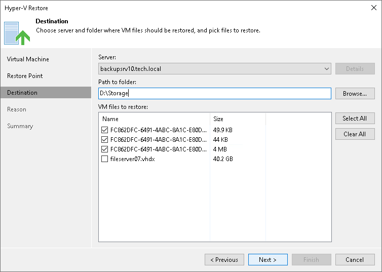

# Step 4. Select VM Files and Destination

At the Restore Destination step of the wizard, select the VM files you want to restore and destination where the restored files must be stored.

1. From the Server list, select where to store VM files: on a Microsoft Hyper-V host, on a Microsoft Windows or Linux server added to the backup infrastructure. Use the Details button to view or change connection settings of the target host or server.
2. In the Path to folder section, specify a path to the folder on the selected host where files must be restored.

To create a new folder for restored files, click Browse. In the Select Folder window, select the target location for VM files and click New Folder at the bottom of the window.

1. In the VM files to restore section, select check boxes next to files that you want to restore.

