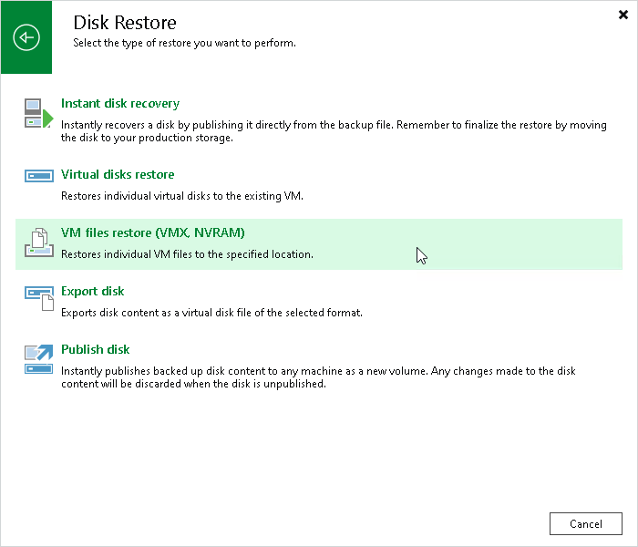

# Step 1. Launch Restore Wizard

To launch the Restore wizard, do one of the following:

* On the Home tab, click Restore > VMware vSphere > Restore from backup > Disk restore > VM files restore (VMX, NVRAM).
* Open the Home view. In the inventory pane, select Backups. In the working area, expand the necessary backup, click the VM whose files you want to restore and click VM Files on the ribbon. Alternatively, you can right-click the VM whose files you want to restore and select Restore VM files.

In this case, you will pass to the [Restore Point](vmfile_restore_point_vm.md) step of the wizard.

