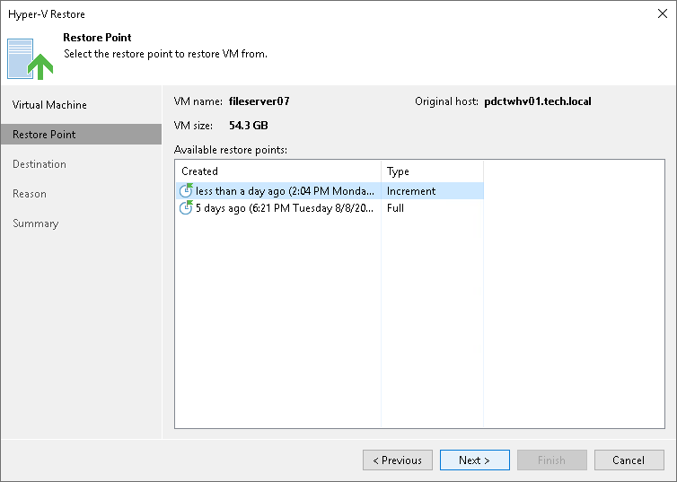

# Step 3. Select Restore Point

In this article

At the Restore Point step of the wizard, select the restore point from which you want to restore the VM files.

Related Topics

* [Backup Repository](backup_repository.md)
* [Object Storage Repository](object_storage_repository.md)

Page updated 1/25/2024

Page content applies to build 13.0.1.1071
