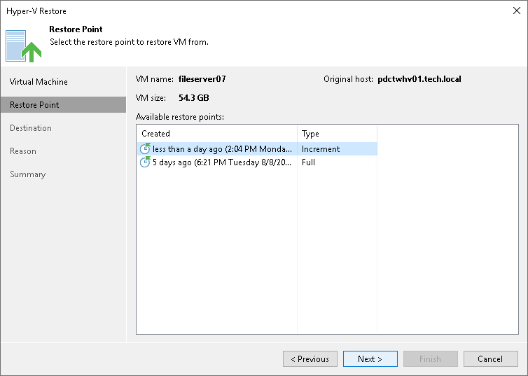

# Step 3. Select Restore Point

At the Restore Point step of the wizard, select the restore point from which you want to restore the VM files.

Related Topics

* [Backup Repository](backup_repository.md)
* [Object Storage Repository](object_storage_repository.md)

