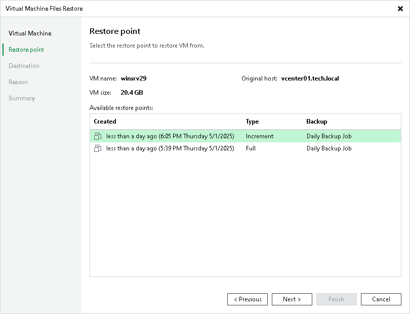

# Step 3. Select Restore Point

At the Restore Point step of the wizard, select a restore point from which you want to restore VM files.

Related Topics

* [Backup Repositories](backup_repository.md)
* [Object Storage Repositories](object_storage_repository.md)

