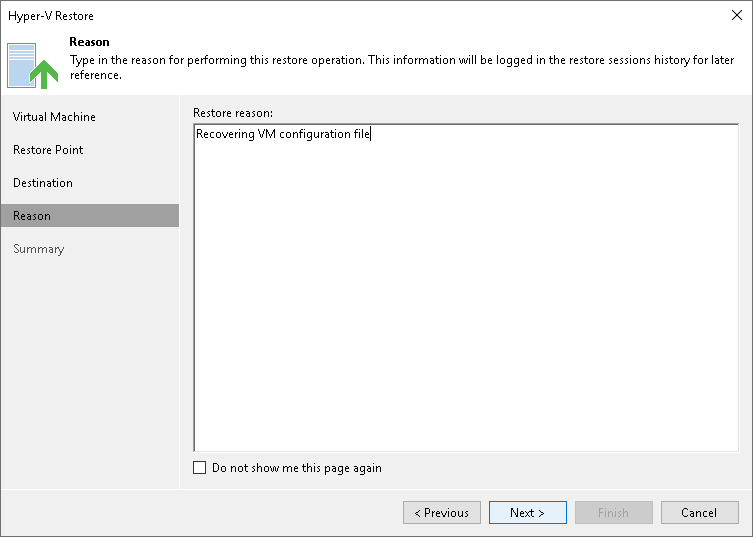

# Step 5. Specify Restore Reason

At the Restore Reason step of the wizard, enter a reason for restoring VM files. The information you provide will be saved in the session history and you can reference it later.

