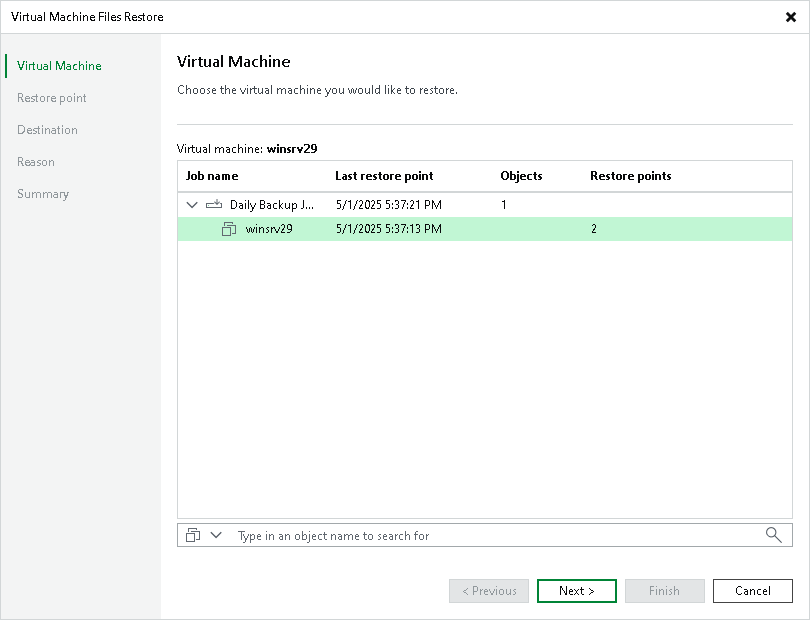

# Step 2. Select VM

In this article

At the Virtual Machine step of the wizard, select the VM whose files you want to restore:

1. In the Virtual machine list, expand the necessary backup.
2. Select the VM.

Page updated 1/25/2024

Page content applies to build 13.0.1.1071
