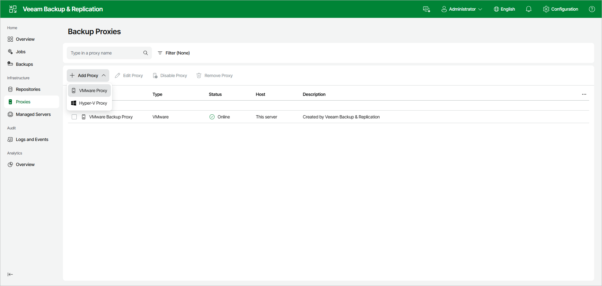

# Step 1. Launch New VMware Proxy Wizard

In this article

To launch the New VMware Proxy wizard, do the following:

1. Open the Proxies node in the management pane.
2. Click Add Proxy on the ribbon and select VMware Proxy.

Page updated 8/7/2025

Page content applies to build 13.0.1.1071
