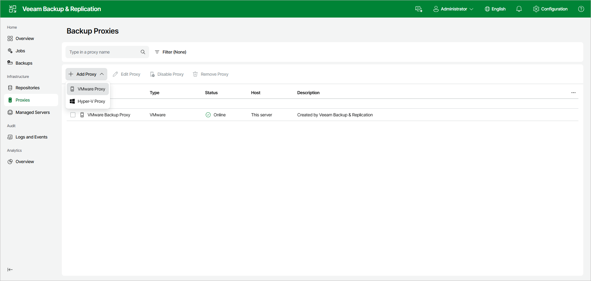

# Step 1. Launch New VMware Proxy Wizard

To launch the New VMware Proxy wizard, do the following:

1. Open the Proxies & Workers node in the management pane.
2. Click Add on the ribbon and select VMware Proxy.

Page updated 2026-06-29

