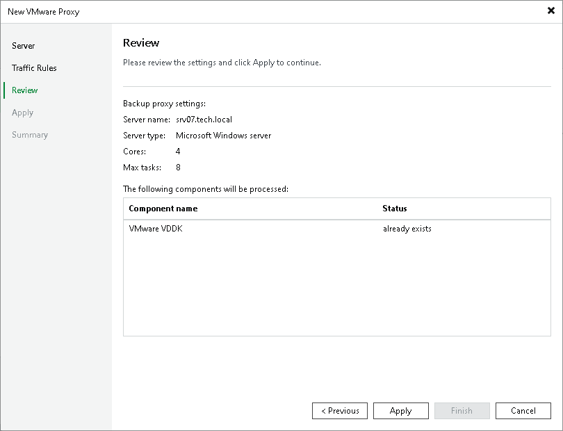

# Step 5. Review Components to Install

In this article

At the Review step of the wizard, review what Veeam Backup & Replication components are already installed on the server and click Apply to start installation of missing components.

Page updated 10/27/2025

Page content applies to build 13.0.1.1071
