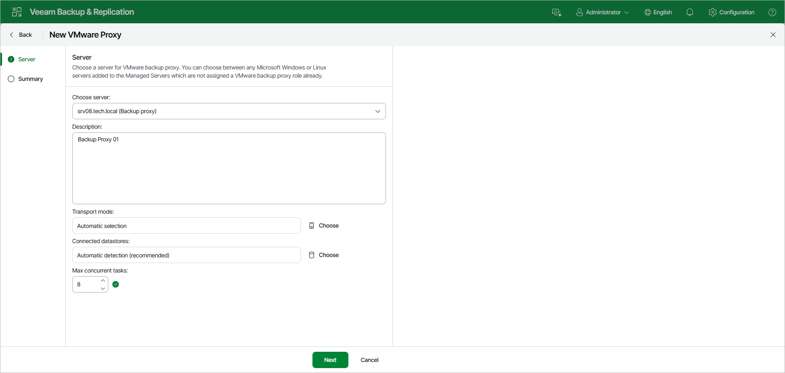

# Step 2. Choose Server

In this article

At the Server step of the wizard, specify server settings for the backup proxy:

1. From the Choose server list, select a Microsoft Windows or Linux server to which you want to assign the backup proxy role.

The list contains only servers added to the backup infrastructure. For more information, see [Adding Microsoft Windows Servers](add_windows_server.md) or [Adding Linux Servers](add_linux_server.md).

|  |
| --- |
| Note |
| If a user account specified for the Linux server does not have root or elevated to root permission, Veeam Backup & Replication will direct you to the Edit Linux Server wizard. In this wizard, you can change the user account. |

1. In the Description field, provide a description. The default description contains information about the user who added the backup proxy, date and time when the backup proxy was added.
2. By default, Veeam Backup & Replication analyzes the backup proxy configuration, defines to which datastores it has access and automatically selects the best transport mode depending on the type of connection between the backup proxy and datastores.

You can select the data transport mode manually. Click Choose on the right of the Transport mode field. In the opened window, select one of the available modes. For more information, see [Transport Modes](transport_modes.md).

1. In the Options section of the Transport Mode window, specify additional options for the selected transport mode:

+ [For the Direct storage access and Virtual appliance transport modes] If the primary transport mode fails during the job session, Veeam Backup & Replication will automatically fail over to the Network transport mode. To disable failover, clear the Failover to network mode if primary mode fails, or is unavailable check box. However, note that failover to the Network transport mode applies automatically if data cannot be processed by other transport modes even if the check box is disabled.
+ [For the Network mode] You can choose to transfer VM data over an encrypted TLS connection. To do this, select the Enable host to proxy traffic encryption in Network mode (NBDSSL) check box. Traffic encryption puts more stress on the CPU of an ESXi host but ensures secure data transfer.

|  |
| --- |
| Note |
| In some cases, the backup proxy may not be able to use some transport modes due to known limitations. For more information, see [Transport Modes](transport_modes.md). If you assign the backup proxy role to a hardened repository, only the Network mode will be available. Other transport modes will be grayed out. |

1. In the Connected datastores field, specify datastores to which the backup proxy has a direct SAN or NFS connection. By default, Veeam Backup & Replication automatically detects all datastores that the backup proxy can access.

You can set up the list of datastores if you want the backup proxy to work with specific datastores. Click Choose on the right of the Connected datastores field, choose Manual selection and add datastores with which the backup proxy must work in the Direct storage access mode.In the Max concurrent tasks field, specify the number of tasks that the backup proxy must handle in parallel. If this value is exceeded, the backup proxy will not start a new task until one of current tasks finishes.

Veeam Backup & Replication creates one task per every VM disk. The recommended number of concurrent tasks is calculated automatically based on available resources. Backup proxies with multi-core CPUs can handle more concurrent tasks. For example, for a 4-core CPU, it is recommended that you specify maximum 8 concurrent tasks, for an 8-core CPU — 16 concurrent tasks. When defining the number of concurrent tasks, consider network traffic throughput in the virtual infrastructure.Click Next.

Page updated 12/3/2025

Page content applies to build 13.0.1.1071
